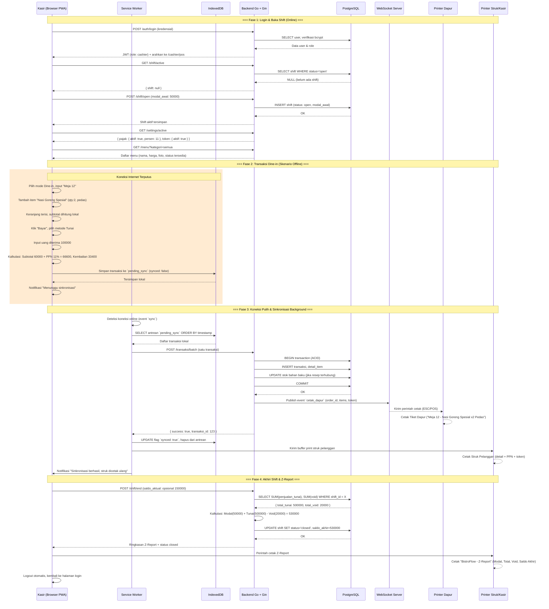
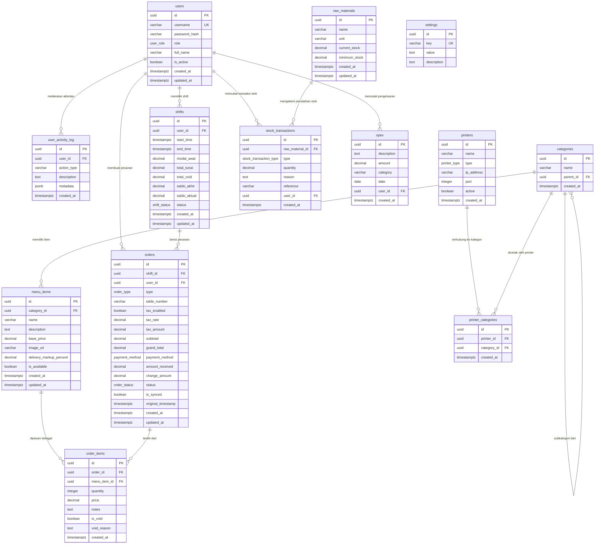

# PRD — Product Requirements Document

**Produk:** BistroFlow POS

> Sistem POS restoran single-tenant dengan ketahanan offline, sinkronisasi dapur real-time, dan RBAC ketat yang memisahkan dasbor owner strategis dari operasi kasir utilitarian.

---

## Ringkasan Produk

BistroFlow POS adalah sistem kasir digital all-in-one yang dirancang khusus untuk restoran single-tenant di Indonesia. Produk ini lahir dari kebutuhan pemilik restoran akan aplikasi POS yang tetap responsif meskipun koneksi internet terputus, sekaligus memberikan pemisahan hak akses yang tegas antara pemilik dan staf kasir. BistroFlow POS memadukan antarmuka kasir yang utilitarian—dengan grid menu besar, kalkulator kembalian, dan input nomor meja/token—serta dasbor owner berbasis bento-grid yang menyajikan metrik bisnis makro seperti gross profit, opex, dan peringatan stok menipis.

Semua transaksi dicatat secara lokal di IndexedDB sebagai antrean `pending_sync` ketika offline, lalu otomatis terkirim ke server begitu koneksi pulih. Pencetakan tiket dapur dilakukan real-time melalui WebSocket, menghilangkan miskomunikasi antara kasir dan dapur. Fitur markup otomatis untuk pesanan delivery (Gojek/Grab) dan kalkulasi pajak PPN memperkuat kontrol harga tanpa menambah beban operasional kasir.

Dengan arsitektur PWA true-offline, BistroFlow POS tidak hanya bertahan saat internet mati, tetapi juga menjamin keamanan data melalui RBAC yang granular—owner dapat mengelola inventaris, opex, dan melihat laporan keuangan, sementara kasir hanya mengakses modul transaksi shift berjalan dan manajemen uang kas. Semua ini dihadirkan dalam tema terang/gelap yang modern dan dapat disesuaikan dengan preferensi pengguna.

## Masalah Inti yang Diselesaikan

Pemilik restoran seringkali terjebak antara sistem POS tradisional yang gagal saat offline dan solusi cloud yang mengharuskan koneksi terus-menerus. Ketika internet mati, antrean pelanggan memanjang dan data penjualan bisa hilang. Di sisi lain, kurangnya pemisahan hak akses membuat kasir berpotensi melihat data keuangan sensitif, mengubah stok, atau bahkan memanipulasi laporan. Banyak POS juga tidak menyatukan inventaris bahan baku, pengeluaran operasional, dan pajak dalam satu alur kerja, sehingga pemilik harus memantau stok mentah secara manual dan sering terlambat mengetahui saat bahan hampir habis. BistroFlow POS mengatasi hal ini dengan arsitektur offline-first yang memastikan transaksi tetap berjalan tanpa internet, RBAC ketat hingga level toggle pengaturan, serta integrasi manajemen stok dan opex yang otomatis mengurangi selisih data.

## Pengguna Target / Persona

- **Pemilik Restoran / Admin Utama (Owner)**  
  Membutuhkan kontrol penuh atas keuangan, inventaris, dan karyawan. Mengakses dasbor owner untuk melihat gross profit, opex, top item, dan stok menipis. Memiliki hak eksklusif mengelola menu, bahan baku, pengeluaran, laporan, dan konfigurasi sistem (pajak, token meja, markup delivery).
- **Kasir / Staf Operasional (Cashier)**  
  Fokus pada kecepatan transaksi selama shift. Menggunakan modul POS dengan grid menu responsif, keranjang belanja, kalkulator kembalian, dan pemilihan mode pemesanan (dine-in, takeaway, delivery). Hanya dapat melihat transaksi shift aktif dan mengelola uang kas (petty cash, Z-Report). Tidak memiliki akses ke data keuangan makro atau inventaris.

## Proposisi Nilai Utama

- **Ketahanan Offline Penuh**: Transaksi tetap berjalan tanpa internet; data disimpan lokal dan disinkronkan otomatis saat online, tanpa kehilangan satu pun pesanan.
- **RBAC Ketat & Pemisahan Antarmuka**: Dasbor owner strategis terpisah dari antarmuka kasir operasional, mencegah akses silang dan menjaga kerahasiaan data.
- **Sinkronisasi Dapur Real-time**: Pesanan langsung tercetak di dapur melalui WebSocket dalam waktu <1 detik, mengurangi miskomunikasi.
- **Manajemen Stok & Opex Terintegrasi**: Inventaris bahan baku otomatis berkurang sesuai penjualan, notifikasi stok minimum, dan pencatatan pengeluaran operasional terpusat.
- **Fleksibilitas Harga & Pajak**: Markup otomatis untuk pesanan delivery dan kalkulasi PPN tanpa intervensi kasir.
- **Antarmuka Modern Bento-Grid**: Desain grid informatif dengan mode terang/gelap, memberikan pengalaman visual yang bersih dan efisien.

## Metrik Keberhasilan

- Rata-rata waktu pemrosesan transaksi kasir (dari pemilihan item hingga cetak struk) ≤ 5 detik.
- Keberhasilan sinkronisasi data offline dari IndexedDB ke server ≥ 99,9% tanpa kehilangan data.
- Akurasi selisih stok bahan baku otomatis ≤ 2% setelah satu bulan penggunaan.
- Skor System Usability Scale (SUS) dari kasir ≥ 80 dalam uji kebergunaan.
- Latensi cetak tiket dapur setelah tombol ‘order’ ditekan ≤ 1 detik.

## Lanskap Kompetitif

Pasar POS restoran Indonesia dikuasai oleh Moka, Olsera, Pawoon, dan Qasir. Moka unggul dalam ekosistem terintegrasi, tetapi fitur offline-nya masih bergantung pada koneksi server, dan RBAC-nya cenderung longgar. Olsera berfokus pada multi-cabang sehingga memberatkan restoran tunggal dengan kompleksitas dan biaya. Pawoon dan Qasir menawarkan POS dasar tanpa manajemen inventaris bahan baku mendalam atau kontrol opex terpusat. BistroFlow POS membedakan diri melalui PWA true-offline pada modul POS—bukan sekadar cache statis—serta pemisahan hak akses yang sangat granular, integrasi dapur real-time, dan markup delivery langsung di kasir, semua dikemas dalam satu solusi yang ringkas bagi restoran single-tenant.

---

## Requirements

## Functional Requirements

### FR-01: Autentikasi Pengguna
- **Deskripsi**: Halaman login (`/login`) menampilkan form username/password dengan dukungan Light/Dark Mode sesuai preferensi sistem. Permintaan `POST /auth/login` memvalidasi kredensial, mencocokkan hash bcrypt, lalu mengembalikan JWT yang memuat klaim `user_id`, `username`, `role` (owner/cashier), dan `exp`. JWT ditandatangani menggunakan RS256. Frontend menyimpan token di `localStorage` dan menyertakannya pada header `Authorization: Bearer <token>` untuk setiap request API. Halaman login tersedia secara publik tanpa otentikasi.
- **Dependensi**: Tabel `users`, RBAC.
- **Validasi**: 
  - Login dengan kredensial benar: redirect ke dashboard sesuai peran (owner → `/owner/dashboard`, kasir → `/cashier/pos`).
  - Login dengan password salah: ditampilkan pesan error, tetap di halaman login.
  - Token expired setelah 12 jam(atau mengikuti shift): request API mengembalikan 401, frontend menampilkan modal login ulang.
  - Percobaan brute force: setelah 5 kali gagal dalam 10 menit, akun diblokir selama 15 menit.

---

### FR-02: Role-Based Access Control (RBAC) dan Pemisahan Tampilan
- **Deskripsi**: Setelah login, pengguna diarahkan ke antarmuka yang sesuai perannya. Owner hanya dapat mengakses panel admin (dashboard Owner, Manajemen Menu, Inventaris, Laporan, dll). Kasir hanya dapat mengakses modul POS dan pengelolaan shift. Setiap endpoint API dilindungi middleware otorisasi: memeriksa JWT, lalu mencocokkan peran yang diizinkan. Akses ilegal menghasilkan HTTP 403 Forbidden. UI Owner menampilkan metrik bisnis makro (Gross Profit, Opex, Top Items, Stok Menipis) dalam tata letak bento‑grid, tanpa keranjang pesanan. UI Kasir eksklusif operasional shift: grid menu besar, keranjang, kalkulator kembalian, mode pemesanan.
- **Dependensi**: FR-01 (Autentikasi), Middleware otorisasi backend.
- **Validasi**:
  - Kasir mencoba mengakses `/owner/dashboard` melalui URL langsung: di-redirect ke `/cashier/pos` atau menampilkan “Akses Ditolak”.
  - API `GET /laporan` dipanggil dengan token Kasir: response 403.
  - UI Kasir tidak menampilkan tombol atau menu yang mengarah ke manajemen inventaris, laporan, atau pengaturan sistem.
  - Toggle light/dark mode tetap aktif dan tersimpan per pengguna tanpa mengganggu batasan peran.

---

### FR-03: Manajemen Karyawan (CRUD Pengguna)
- **Deskripsi**: Hanya Owner yang dapat mengakses halaman Manajemen Karyawan. Owner dapat membuat, membaca, memperbarui, dan menonaktifkan akun (soft delete) kasir atau admin lain. Form berisi username, password (minimal 8 karakter, harus dikonfirmasi), nama lengkap, dan peran (`owner` atau `cashier`). Saat pembuatan, password di-hash menggunakan bcrypt. Owner tidak dapat mengubah perannya sendiri. Menonaktifkan akun (is_active = false) menyebabkan pengguna tidak bisa login. Aktivitas manajemen karyawan dicatat di `user_activity_log`.
- **Dependensi**: FR-01, Tabel `users`.
- **Validasi**:
  - Owner menambah kasir baru: akun muncul di tabel, dapat login dengan kredensial yang diberikan.
  - Owner mencoba menghapus akun dirinya sendiri: operasi dicegah.
  - Kasir mencoba mengakses halaman Manajemen Karyawan: tidak bisa (tidak ada menu, API 403).

---

### FR-04: Modul POS – Pemuatan dan Manajemen Menu
- **Deskripsi**: Halaman POS Kasir memuat data menu dari endpoint `GET /menu?kategori=semua` (jika online) atau dari cache IndexedDB (jika offline). Grid menu ditampilkan dalam kartu besar dengan foto, nama, harga dasar, dan label ketersediaan (“Tersedia” / “Sold Out”). Item yang di-*toggle* “Sold Out” oleh Kasir (melalui tombol cepat di grid) tidak dapat ditambahkan ke keranjang. Status ketersediaan ini bersifat sementara dan tidak mempengaruhi data inventaris bahan baku; reset saat menu diperbarui. Kasir dapat menyaring berdasarkan kategori.
- **Dependensi**: API Menu, FR-02 (RBAC).
- **Validasi**:
  - Item dengan `is_available = true` muncul dengan label hijau “Tersedia”; jika false, tampil redup dan tidak bisa diklik.
  - Kasir men-*toggle* “Sold Out” pada suatu item: grid langsung berubah, pesan “Item ditandai tidak tersedia” muncul, dan item tidak bisa ditambahkan ke keranjang sampai diaktifkan kembali.
  - Saat offline, data menu diambil dari IndexedDB (cache terakhir).

---

### FR-05: Keranjang Pesanan dan Manajemen Sebelum Pembayaran
- **Deskripsi**: Kasir menambahkan item menu ke keranjang dengan mengetuk item. Muncul modal jika item memiliki opsi (level pedas, catatan khusus). Kuantitas default 1, dapat diubah di keranjang. Kasir dapat menambah catatan bebas. Subtotal dihitung di sisi klien dan ditampilkan real-time. Tombol “Hold Bill” menyimpan keranjang ke daftar tagihan ditunda (disimpan di state local, bisa dipulihkan). Daftar tagihan ditunda dapat diakses kembali untuk melanjutkan atau dibatalkan. Setiap item di keranjang dapat di-*void* dengan memilih alasan cepat (“Salah Input”, “Pelanggan Batal”) melalui ikon hapus, mengurangi subtotal. Void hanya bisa dilakukan sebelum pembayaran final.
- **Dependensi**: Modul POS, FR-04.
- **Validasi**:
  - Item dengan catatan ditambahkan, keranjang menampilkan item dengan catatan.
  - Hold Bill: keranjang kosong, tagihan muncul di daftar “Bill Tertunda”. Dapat diklik untuk melanjutkan.
  - Void item: subtotal turun, item dihapus dari keranjang, log void tercatat (alasan). Void tidak bisa dilakukan setelah tombol “Bayar” ditekan.

---

### FR-06: Mode Pemesanan (Dine‑in, Takeaway, Delivery) dan Markup
- **Deskripsi**: Di header POS, Kasir memilih mode pesanan: Dine‑in, Takeaway, atau Delivery (Gojek/Grab). Mode Delivery mengaktifkan perhitungan harga markup: harga item menjadi `base_price + (base_price * delivery_markup_percent / 100)`, ditampilkan di grid dan keranjang. Markup persentase diatur Owner per item menu. Pada mode Dine‑in, jika fitur Input Nomor Meja/Token aktif (dari pengaturan sistem), field input teks muncul untuk mencatat nomor meja/token. Field ini bersifat opsional (tidak wajib diisi).
- **Dependensi**: FR-04, FR-29 (Pengaturan Token), tabel `menu_items.delivery_markup_percent`.
- **Validasi**:
  - Pilih mode Delivery: harga item di grid berubah sesuai persentase markup (contoh: harga dasar 50.000, markup 10% → 55.000).
  - Pilih mode Dine‑in: tampil label “Meja/Token” di area keranjang. Jika fitur token dinonaktifkan Owner, label tidak muncul.
  - Mode Takeaway: tidak ada markup, tidak ada field token.

---

### FR-07: Kalkulasi Pajak Otomatis (PPN)
- **Deskripsi**: Jika fitur PPN diaktifkan oleh Owner (`settings` key `tax_enabled` bernilai `true`), setiap transaksi dikenai PPN dengan persentase yang tersimpan di `settings` (key `tax_rate`, default 11%). Perhitungan dilakukan di sisi klien: `tax_amount = subtotal * (tax_rate / 100)`, `grand_total = subtotal + tax_amount`. Nilai PPN ditampilkan terpisah di ringkasan pembayaran. Saat menyimpan transaksi (online atau offline), semua nilai tersebut ikut dikirim. Jika fitur PPN dinonaktifkan, `tax_amount` = 0 dan `grand_total` = `subtotal`.
- **Dependensi**: FR-06, FR-29 (Toggle PPN), `settings` table.
- **Validasi**:
  - PPN aktif 11%, subtotal 100.000 → grand total 111.000, tampilan menunjukkan “PPN 11.000”.
  - PPN nonaktif: tidak ada baris PPN, grand total = subtotal.
  - Ubah persentase PPN saat transaksi berlangsung: sistem menggunakan persentase terbaru yang berlaku saat tombol “Proses” ditekan.

---

### FR-08: Pembayaran Tunai dan Non‑Tunai
- **Deskripsi**: Setelah menekan “Bayar”, Kasir memilih metode pembayaran: Tunai, Debit, Kredit, QRIS, atau Lainnya. Jika Tunai, field “Uang Diterima” muncul. Kasir memasukkan jumlah, sistem otomatis menghitung kembalian (`amount_received - grand_total`) dan menampilkannya dengan jelas. Jika jumlah kurang, tombol “Proses” dinonaktifkan dengan pesan error. Untuk pembayaran non‑tunai, field uang diterima tidak muncul, dan `amount_received` diset null. Setelah konfirmasi, transaksi diproses (online/offline).
- **Dependensi**: FR-07, modul pembayaran POS.
- **Validasi**:
  - Tunai: Grand total 80.000, uang diterima 100.000 → kembalian 20.000 ditampilkan. Uang diterima 50.000 → tombol proses abu‑abu, pesan “Uang kurang 30.000”.
  - Non‑tunai: field uang diterima tersembunyi, transaksi bisa langsung diproses.

---

### FR-09: Transaksi Offline – Penyimpanan di IndexedDB
- **Deskripsi**: Ketika koneksi internet terdeteksi putus (event `offline`), modul POS tetap beroperasi penuh. Saat Kasir menekan “Proses”, transaksi disimpan di IndexedDB (object store `pending_sync`) dengan struktur yang mencakup seluruh header pesanan (timestamp, shift_id, user_id, mode, table_number, metode bayar, grand_total, dll.) dan detail item. Flag `synced` di-set `false`. UI menampilkan pesan “Transaksi tersimpan lokal – menunggu sinkronisasi”. Transaksi ini tidak dicetak saat itu juga (printer tidak merespons). Sistem mencegah shift diakhiri selama ada pending sync.
- **Dependensi**: PWA Service Worker, IndexedDB schema, FR-08.
- **Validasi**:
  - Matikan koneksi internet, lakukan transaksi: data masuk ke IndexedDB, UI memberi tahu “Menunggu sinkronisasi”, tidak ada error.
  - Periksa IndexedDB via DevTools: record ada dengan `synced: false`.
  - Coba akhiri shift saat masih ada pending: muncul peringatan dan dicegah.

---

### FR-10: Sinkronisasi Otomatis Saat Koneksi Pulih
- **Deskripsi**: Service Worker mendeteksi event `online` dan memicu sinkronisasi background sync. Semua transaksi diambil dari IndexedDB (flag `synced: false`) diurutkan berdasarkan `original_timestamp`. Satu per satu dikirim ke endpoint `POST /transaksi/batch`. Backend memproses dengan transaksi database (ACID): memasukkan data ke tabel `orders` dan `order_items`, memperbarui stok bahan baku jika resep terhubung, dan menghitung data keuangan. Jika berhasil, backend mengirim event WebSocket `cetak_dapur` dan respon sukses. Service Worker menerima respon, mengubah flag `synced` menjadi `true`, menghapus dari antrean IndexedDB, serta mengirim perintah cetak struk ke printer Kasir (buffer print). Jika terdapat error (validasi stok, dll.), transaksi tetap disimpan dengan status `completed` namun diberi catatan, dan notifikasi dikirim ke dasbor Owner.
- **Dependensi**: FR-09, WebSocket Server, API Transaksi, IndexedDB.
- **Validasi**:
  - Offline → buat 2 transaksi → onlinekan kembali. Kedua transaksi muncul di daftar pesanan server dalam waktu < 5 detik setelah online.
  - Printer Kasir mencetak struk yang sebelumnya tertahan.
  - Jika terjadi konflik stok, pesanan tetap tercatat, Owner mendapat notifikasi di dasbor.

---

### FR-11: Manajemen Shift dan Cash Drawer
- **Deskripsi**: Kasir yang baru login dan belum memiliki shift `open` akan diminta memasukkan Modal Awal (petty cash) melalui dialog. Data shift baru (`POST /shift/open`) disimpan dengan status `open`. Selama shift, setiap transaksi tunai dicatat dan nantinya dijumlahkan. Saat Kasir menekan “Akhiri Shift”, sistem menghitung `total_tunai` (sum transaksi tunai sukses) dan `total_void`, lalu menghitung `saldo_akhir = modal_awal + total_tunai - total_void`. Ringkasan ini ditampilkan, dan Kasir opsional menginput Saldo Aktual (fisik) untuk rekonsiliasi. Shift ditutup (`POST /shift/end`), status menjadi `closed`, data shift disimpan. Sistem kemudian mencetak Z‑Report melalui printer Kasir.
- **Dependensi**: FR-01, modul POS, integrasi printer.
- **Validasi**:
  - Setelah login pertama hari itu, dialog modal awal muncul; setelah diisi shift baru tersimpan.
  - Selama shift, transaksi tunai otomatis menambah total penjualan.
  - Akhiri shift: tampilan menampilkan modal awal, total tunai, total void, saldo akhir. Jika Kasir input saldo aktual, selisih dihitung dan ditampilkan.
  - Shift ditutup: status berubah, tidak bisa tambah transaksi lagi.

---

### FR-12: Pencetakan Z‑Report Fisik
- **Deskripsi**: Saat shift ditutup, sistem mengirim perintah cetak Z‑Report ke printer struk lokal (USB/Bluetooth). Format cetakan predefinisi: header “BistroFlow – Z‑Report”, tanggal & jam shift, nama kasir, modal awal, total penjualan tunai, total void, perkiraan saldo akhir, saldo aktual (jika diisi), dan selisih. Jika koneksi printer tidak tersedia/offline, Z‑Report tetap disimpan dan dapat dicetak ulang dari riwayat shift (halaman khusus Owner). 
- **Dependensi**: FR-11, integrasi printer frontend.
- **Validasi**:
  - Setelah tutup shift, printer mencetak dokumen sesuai format, termasuk semua angka yang muncul di ringkasan.
  - Tes offline printer: muncul notifikasi “Printer tidak tersedia”, Z‑Report tersimpan di daftar untuk dicetak ulang.

---

### FR-13: Pencetakan Tiket Dapur Real‑time (WebSocket)
- **Deskripsi**: Setelah transaksi berhasil disimpan di backend (baik online maupun setelah sinkronisasi), server menerbitkan event WebSocket ke channel dapur. Data yang dikirim: `order_id`, `table_number`, daftar item (nama, qty, catatan), dan timestamp. Printer dapur yang terdaftar di tabel `printers` menerima perintah cetak via driver ESC/POS. WebSocket menjaga koneksi persisten; jika putus, server menyimpan event di buffer selama 5 menit. Jika lebih, dicatat sebagai log error. UI Kasir menampilkan indikator “Tiket Dapur Terkirim” setelah konfirmasi (jika online). 
- **Dependensi**: WebSocket server, manajemen printer, FR-10 (sinkronisasi).
- **Validasi**:
  - Buat transaksi online: dalam waktu < 1 detik printer dapur mencetak tiket berisi item dan nomor meja.
  - Matikan printer dapur: backend mencatat error, dasbor Owner memberi notifikasi “Cetak dapur gagal”.
  - Sinkronisasi setelah offline: tiket dapur dicetak begitu transaksi batch berhasil.

---

### FR-14: Routing Printer Berdasarkan Kategori Menu
- **Deskripsi**: Owner dapat mengonfigurasi printer dapur mana yang menangani kategori menu tertentu melalui tabel `printer_categories`. Saat tiket dapur dikirim, sistem memeriksa kategori dari masing‑masing `order_item`, lalu mengarahkan perintah cetak hanya ke printer yang dipetakan. Item tanpa kategori akan dicetak di printer dapur utama (default).
- **Dependensi**: FR-13, manajemen printer, tabel `printer_categories`.
- **Validasi**:
  - Atur Printer A untuk kategori “Makanan”, Printer B untuk “Minuman”. Pesan dua item dari masing‑masing kategori: setiap printer hanya mencetak item yang sesuai.

---

### FR-15: Manajemen Inventaris Bahan Baku (CRUD)
- **Deskripsi**: Di halaman Inventaris (owner only), Owner dapat melihat tabel semua bahan baku dengan kolom: Nama, Satuan, Stok Saat Ini, Ambang Minimum, Status (Normal/Menipis). Owner bisa menambahkan bahan baku baru (nama, satuan, stok awal, ambang minimum), mengedit, atau menonaktifkan (soft delete) bahan. Ketika stok saat ini ≤ ambang minimum, status berubah menjadi “Menipis” dan item tersebut muncul di kartu “Stok Menipis” di dashboard Owner.
- **Dependensi**: RBAC, tabel `raw_materials`.
- **Validasi**:
  - Tambahkan “Daging Sapi” dengan stok awal 20, ambang 10: muncul di tabel dengan status Normal.
  - Edit stok menjadi 5 (≤10): status Menipis, muncul di dashboard.
  - Hapus bahan baku (soft delete) yang tidak memiliki transaksi dalam 30 hari terakhir: diizinkan; jika masih ada transaksi, sistem menolak.

---

### FR-16: Pencatatan Barang Masuk dan Barang Keluar
- **Deskripsi**: Owner mencatat transaksi stok melalui form “Barang Masuk” (pilih bahan, jumlah, supplier opsional, keterangan) dan “Barang Keluar” (pilih bahan, jumlah, alasan: pemakaian harian, kadaluarsa, dll.). Sistem memperbarui `current_stock` pada tabel `raw_materials` secara atomik. Setiap perubahan menyimpan record di `stock_transactions` dengan tipe `in`, `out`, atau `adjustment` (koreksi). Owner dapat melihat riwayat perubahan stok. Tidak diperbolehkan mencatat barang keluar melebihi stok yang ada.
- **Dependensi**: FR-15, tabel `stock_transactions`.
- **Validasi**:
  - Barang masuk 10 kg Daging: stok bertambah 10, log muncul.
  - Barang keluar 15 kg dari stok 5 kg: ditolak dengan pesan “Stok tidak mencukupi”.
  - Koreksi stok (adjustment) dicatat sebagai tipe `adjustment` dengan alasan.

---

### FR-17: Notifikasi Stok Menipis di Dashboard Owner
- **Deskripsi**: Pada dashboard Owner, kartu “Stok Menipis” menampilkan maksimal 5 bahan baku dengan `current_stock ≤ minimum_stock`. Setiap item dilengkapi tombol “Catat Pembelian” yang mengarahkan langsung ke form Barang Masuk untuk item tersebut. Notifikasi juga dapat muncul di pusat notifikasi in‑app (ikon lonceng).
- **Dependensi**: FR-15, FR-16, dashboard UI.
- **Validasi**:
  - Ada 3 item di bawah ambang: ketiganya muncul di kartu. Klik “Catat Pembelian” → terbuka form dengan bahan tersebut terpilih.
  - Pusat notifikasi menampilkan “Stok Daging Sapi menipis (2 kg dari ambang 5 kg)”.

---

### FR-18: Manajemen Pengeluaran Operasional (Opex)
- **Deskripsi**: Owner dapat mencatat pengeluaran di luar HPP melalui form (deskripsi, jumlah, kategori opsional, tanggal). Data disimpan di tabel `opex`. Pengeluaran dikaitkan dengan user owner yang mencatat. Data opex digunakan dalam laporan keuangan untuk menghitung Gross Profit.
- **Dependensi**: RBAC, tabel `opex`.
- **Validasi**:
  - Input pengeluaran “Listrik” 500.000: muncul di daftar opex, dan total opex bertambah di dashboard.

---

### FR-19: Laporan Keuangan Harian/Mingguan/Bulanan
- **Deskripsi**: Halaman laporan hanya diakses Owner. Pemilih periode: Hari Ini, Minggu Ini, Bulan Ini, atau rentang kustom. Query agregasi dari backend menghitung: Total Transaksi, Pendapatan Kotor (sum subtotal), PPN Terkumpul, Total Void, Total Opex, dan Gross Profit (Pendapatan Kotor - PPN - Void - Opex). Grafik batang “Penjualan Harian” (bila periode lebih dari satu hari) dirender di client dengan Recharts. Tabel “Top 10 Item” menampilkan menu yang paling sering dibeli (qty terjual dan total nilai). Tidak termasuk transaksi yang belum tersinkron (is_synced false).
- **Dependensi**: Laporan API, modul transaksi dan opex.
- **Validasi**:
  - Pilih “Bulan Ini”: muncul ringkasan sesuai data, grafik menampilkan pendapatan per hari, top items terlihat.
  - Tidak ada transaksi: grafik kosong, kartu bernilai 0, pesan “Tidak ada data untuk periode ini”.
  - Jika terjadi perubahan tarif PPN di periode tersebut, laporan menyesuaikan per transaksi; catatan kaki muncul.

---

### FR-20: Ekspor Data Laporan (CSV dan PDF)
- **Deskripsi**: Owner dapat mengekspor laporan dalam dua format:
  - **CSV**: berisi daftar transaksi individual dengan kolom: Tanggal, No Order, Item, Qty, Harga Satuan, Subtotal, PPN, Grand Total, Metode Bayar. File diunduh dalam format `.csv`.
  - **PDF Ringkasan**: mencakup kop restoran, periode laporan, ringkasan kartu, grafik penjualan, dan tabel top item. File dihasilkan di sisi backend dan dikirim sebagai blob.
- **Dependensi**: FR-19, backend library PDF (misal `gofpdf`), frontend download.
- **Validasi**:
  - Klik “Ekspor CSV”: browser mengunduh file dengan nama “laporan_bulan_ini.csv”, data sesuai transaksi.
  - Klik “Ekspor PDF”: file PDF terbuka di tab baru, memuat ringkasan yang sama seperti di layar.

---

### FR-21: Pengaturan Sistem Global (Toggle PPN dan Token)
- **Deskripsi**: Di halaman System Settings (Owner), terdapat sakelar untuk:
  - “Aktifkan PPN”: mengubah key `tax_enabled` di tabel `settings`. Di bawahnya ada input angka `tax_rate` (0-100, dua desimal). Jika sakelar OFF, input disembunyikan.
  - “Aktifkan Input Nomor Meja/Token”: mengubah key `token_enabled`.
  Perubahan disimpan langsung dan berlaku seketika. Perubahan pengaturan dicatat di `user_activity_log`. Endpoint publik `GET /settings/active` mengembalikan status terkini untuk kedua pengaturan; modul POS mengambilnya saat inisialisasi dan dapat diperbarui secara real‑time lewat polling atau WebSocket (opsional).
- **Dependensi**: FR-02, `settings` table.
- **Validasi**:
  - Aktifkan PPN, set 12%: di POS, setelah refresh, PPN 12% muncul di kalkulasi.
  - Nonaktifkan token: field nomor meja di POS menghilang.
  - Kasir mengakses endpoint `POST /settings`: 403.

---

### FR-22: Manajemen Menu (Item dan Kategori)
- **Deskripsi**: Owner dapat mengelola menu melalui antarmuka: membuat, mengedit, menghapus (soft) item menu. Setiap item memiliki: nama, deskripsi, foto (URL), harga dasar, persentase markup delivery (default 0), dan kategori. Kategori bisa dibuat, diubah, dihapus, serta memiliki subkategori (parent_id). Item yang dihapus tidak ditampilkan di POS. Perubahan harga dan markup langsung diterapkan di POS setelah refresh data.
- **Dependensi**: Tabel `menu_items` dan `categories`.
- **Validasi**:
  - Tambahkan item baru dengan gambar, harga, markup: muncul di grid POS sesuai kategori.
  - Ubah harga dasar: setelah POS merefresh menu (tombol atau otomatis), harga baru tampil.

---

### FR-23: Manajemen Printer (Hardware)
- **Deskripsi**: Owner dapat mendaftarkan printer di halaman Pengaturan Printer. Setiap printer memiliki nama, tipe (`kitchen` atau `receipt`), alamat IP/port (untuk network printer), dan status aktif. Printer tipe `kitchen` digunakan untuk tiket dapur; tipe `receipt` untuk struk pelanggan (namun struk biasanya melalui printer lokal frontend, jadi di sini lebih ke dokumentasi). Printer dapat dipetakan ke kategori (FR-14). Printer yang dinonaktifkan tidak akan menerima perintah cetak.
- **Dependensi**: Tabel `printers`, integrasi WebSocket/cetak.
- **Validasi**:
  - Daftarkan printer dapur baru: saat tes koneksi, backend mengirim perintah uji cetak (jika network).
  - Nonaktifkan printer: tidak menerima tiket dapur.

---

### FR-24: PWA – Service Worker Caching dan Offline Mode
- **Deskripsi**: Aplikasi Next.js dikonfigurasi sebagai PWA. Service Worker melakukan pra‑cache aset statis (HTML, JS, CSS, font, gambar) saat pertama kali diinstal. Saat offline, halaman POS tetap dapat diakses penuh karena dibangun dengan Client‑Side Rendering. Semua logika transaksi berjalan di klien; data ditampilkan dari cache IndexedDB. Saat koneksi pulih, Service Worker menghapus cache usang dan memperbarui aset sesuai versi baru.
- **Dependensi**: PWA build tool, FR-09.
- **Validasi**:
  - Buka aplikasi, periksa Cache Storage: semua aset UI tercache.
  - Matikan koneksi, refresh halaman POS: halaman tetap berfungsi, menu muncul.

---

### FR-25: Aktivitas Log (Audit Trail)
- **Deskripsi**: Setiap aksi penting (login, perubahan menu, transaksi stok, perubahan pengaturan, dll.) dicatat di `user_activity_log` dengan `action_type`, `description`, dan `metadata` JSONB. Owner dapat melihat log aktivitas di halaman khusus (terfilter berdasarkan user dan tipe). Log tidak dapat dihapus atau dimodifikasi.
- **Dependensi**: Tabel `user_activity_log`, middleware logging.
- **Validasi**:
  - Login berhasil: muncul entri “LOGIN” di log.
  - Owner mengubah tarif PPN: entri “TOGGLE_PAJAK”, metadata berisi nilai lama dan baru.

---

### FR-26: Landing Page SSR dan SEO
- **Deskripsi**: Halaman publik `/` menggunakan SSR Next.js untuk optimasi mesin pencari. Mengadaptasi layout “Optibiz” dengan tema restoran: Hero Section (headline, CTA, mockup device POS), Metric Section (angka pengalaman, pesanan diproses), Feature Cards (Offline Mode, Sinkronisasi Dapur, Manajemen Meja), Testimoni, dan Footer. Desain konsisten dengan Design System Bento‑grid dan palet warna brand. Halaman ini tidak memerlukan autentikasi.
- **Dependensi**: Next.js SSR, SEO metadata.
- **Validasi**:
  - Akses `/`, lihat source: konten dirender di server.
  - Google Lighthouse SEO score minimal 90.

---

## Non-Functional Requirements

### Performance
- **NFR-P01**: Waktu respon API (p95) untuk endpoint kritis (misal `POST /transaksi`, `GET /menu`) ≤ 200 ms dalam kondisi server normal dan database lokal.
- **NFR-P02**: Latensi pengiriman perintah cetak tiket dapur melalui WebSocket dari server ke printer dapur ≤ 500 ms sejak transaksi tercatat di database.
- **NFR-P03**: Sinkronisasi batch transaksi offline (maksimal 100 antrean) harus selesai dalam waktu kurang dari 5 detik setelah koneksi pulih, tanpa kehilangan data.
- **NFR-P04**: Ukuran cache Service Worker (aset statis) tidak melebihi 5 MB untuk mendukung penyimpanan perangkat low-end. IndexedDB dapat menyimpan hingga 500 MB data transaksi offline (sesuai kuota browser).
- **NFR-P05**: Waktu render halaman POS (first paint) ≤ 1 detik pada koneksi 4G, dengan Time to Interactive ≤ 2 detik.

### Security
- **NFR-S01**: Semua password pengguna di-hash menggunakan bcrypt dengan cost factor minimal 12 sebelum disimpan di database.
- **NFR-S02**: JSON Web Token (JWT) menggunakan algoritma RS256 dengan masa berlaku 12 jam(atau mengikuti shift). Token wajib disertakan pada setiap request API yang dilindungi.
- **NFR-S03**: Input pengguna harus divalidasi dan disanitasi di sisi server untuk mencegah Cross‑Site Scripting (XSS) dan injeksi basis data. Gunakan parameterized query untuk semua operasi database.
- **NFR-S04**: Konfigurasi CORS membatasi origin hanya ke domain frontend yang sah (production dan development). Preflight request diatur secara ketat.
- **NFR-S05**: Semua komunikasi antara frontend dan backend wajib melalui HTTPS, termasuk untuk endpoint WebSocket (WSS).
- **NFR-S06**: Data sensitif dalam log (seperti password) tidak boleh tercetak. Jika diperlukan debug, masking harus diterapkan.

### Reliability
- **NFR-R01**: Sistem harus mempertahankan data transaksi di IndexedDB secara utuh meskipun halaman POS di-refresh atau browser ditutup saat offline. Data tidak hilang sebelum sinkronisasi sukses.
- **NFR-R02**: Sinkronisasi latar belakang menerapkan mekanisme retry dengan exponential backoff (maksimal 5 kali percobaan) jika gagal.
- **NFR-R03**: Transaksi basis data yang melibatkan keuangan (orders, stock) harus ACID: atomik, konsisten, terisolasi (level serializable untuk laporan opsional), dan durable. Setiap perubahan keuangan dicatat dalam log audit.
- **NFR-R04**: Uptime server minimal 99,5% di luar jendela pemeliharaan yang dijadwalkan.
- **NFR-R05**: Backup penuh database PostgreSQL dilakukan setiap hari secara otomatis, dengan retensi 7 hari. Point‑in‑time recovery (PITR) harus diaktifkan.
- **NFR-R06**: Jika server WebSocket mati mendadak, sistem harus dapat melanjutkan cetak tiket dapur melalui fallback polling HTTP dan memberi notifikasi ke admin.

### Accessibility
- **NFR-A01**: Antarmuka pengguna (termasuk mode gelap/terang) harus memenuhi standar WCAG 2.1 level AA: rasio kontras teks minimal 4,5:1 untuk teks normal, 3:1 untuk teks besar; semua elemen interaktif dapat diakses dan dioperasikan menggunakan keyboard.
- **NFR-A02**: Semua form input harus memiliki label yang jelas dan terkait secara programatik. Pesan error harus diidentifikasi secara deskriptif.
- **NFR-A03**: Aplikasi mendukung preferensi pengguna untuk pengurangan gerakan (prefers‑reduced‑motion) pada animasi.

### Maintainability
- **NFR-M01**: Kode frontend dibangun dengan komponen React yang modular dan dapat digunakan kembali, mengikuti Atomic Design atau struktur berbasis fitur.
- **NFR-M02**: API backend harus di-versioning (`/api/v1/`) untuk memungkinkan perubahan di masa depan tanpa merusak klien yang ada. Dokumentasi API tersedia dalam format OpenAPI 3.0 (Swagger).
- **NFR-M03**: Semua error server dicatat ke log terpusat (misal ELK stack atau serupa), dengan level `error`, `warn`, `info`. Setiap entri log mencakup timestamp, ID request, dan deskripsi.
- **NFR-M04**: Konfigurasi aplikasi (database URL, kunci JWT, pengaturan printer) disimpan sebagai environment variable, bukan hard‑coded.
- **NFR-M05**: Deployment dilakukan melalui container Docker, dengan CI/CD otomatis untuk testing dan build. Database migration dikelola menggunakan tool seperti `golang-migrate`.

### Usability
- **NFR-U01**: Tampilan POS untuk Kasir harus sangat intuitif: pengguna baru dapat menyelesaikan transaksi sederhana (pilih item, bayar) dalam waktu kurang dari 2 menit tanpa pelatihan sebelumnya. Waktu pelatihan total untuk menguasai seluruh operasi (shift, void, hold) tidak lebih dari 15 menit.
- **NFR-U02**: Tombol aksi di POS memiliki ukuran tap target minimal 48 × 48 dp untuk kenyamanan di layar sentuh.

### Kompatibilitas dan Deployment
- **NFR-C01**: Aplikasi frontend harus berjalan pada versi terbaru Chrome, Firefox, Safari, dan Edge. Dukungan untuk browser lama (IE11) tidak diwajibkan.
- **NFR-C02**: Backend Go dikompilasi sebagai binary statis dan dapat berjalan di Linux server (Ubuntu 20.04+) dengan resource minimal 1 vCPU, 512 MB RAM.
- **NFR-C03**: Aplikasi harus dapat di-deploy di lingkungan VPS/cloud (AWS, GCP, atau DigitalOcean) menggunakan satu perintah Docker Compose.

---

## Core Features

### Role-Based Access Control (RBAC) dengan Pemisahan Dasbor
- **Deskripsi**:  
  BistroFlow POS menerapkan RBAC ketat yang membagi pengguna ke dalam dua peran utama: Owner (Admin Utama) dan Kasir. Setelah login menggunakan kredensial yang disimpan di PostgreSQL dengan hashing bcrypt, sistem mengarahkan pengguna ke dasbor yang sesuai. Dasbor Owner menampilkan metrik bisnis level makro – gross profit, total opex, top-selling items, dan indikator stok menipis – dalam tata letak bento-grid modern (palet `#1A5D3A`/`#111827` light, `#217A4A`/`#F9FAFB` dark). Dasbor Kasir secara fundamental berbeda: fokus eksklusif pada operasional shift berjalan, menampilkan grid menu besar dengan foto item, keranjang pesanan, kalkulator kembalian, dan tombol aksi besar yang minim distraksi. Tidak ada akses ke data keuangan, inventaris, atau pengaturan sistem dari sisi Kasir. Backend Go + Gin menerapkan middleware otorisasi yang memvalidasi token JWT pada setiap permintaan, memastikan kepatuhan RBAC di level API.

- **User Story**:  
  Sebagai Pemilik Restoran, saya ingin semua staf hanya dapat mengakses modul yang sesuai dengan perannya sehingga data keuangan dan inventaris sensitif terlindungi dan kasir tidak bisa mengubah pengaturan sistem atau mengintip laporan laba-rugi.

- **Acceptance Criteria**:
  1. Halaman login mengotentikasi pengguna dan menerbitkan JWT yang mencakup klaim peran (`role: "owner"` atau `role: "cashier"`).
  2. Setelah login, Owner otomatis diarahkan ke `/owner/dashboard` yang menampilkan kartu Gross Profit (periode berjalan), Total Opex, 5 Top-Selling Items, dan daftar item dengan stok < ambang minimum.
  3. Kasir diarahkan ke `/cashier/pos` setelah input modal awal shift (jika shift baru); jika shift sedang berjalan, langsung masuk ke grid menu dan keranjang.
  4. Setiap endpoint API di-backend memeriksa peran JWT; jika Kasir mencoba mengakses endpoint Owner (misal `GET /reports`), sistem mengembalikan HTTP 403.
  5. UI dasbor Owner tidak menampilkan elemen transaksi aktif (keranjang, kalkulator kembalian), dan UI Kasir tidak menampilkan kartu laporan atau data stok mentah.
  6. Toggle light/dark mode yang dipilih pengguna tersimpan di localStorage dan berlaku konsisten di kedua dasbor tanpa mengganggu fungsionalitas.

- **Prioritas**: High
- **Dependensi**: Fitur Autentikasi (login, JWT), modul Manajemen Karyawan (penetapan peran), modul Laporan untuk data dasbor Owner, modul POS untuk dasbor Kasir.
- **Edge Cases**:
  - Token JWT kedaluwarsa saat di tengah shift Kasir: sistem harus menampilkan modal login ulang tanpa menghilangkan data transaksi sementara (jika ada dalam session storage).
  - Perangkat yang sama digunakan bergantian oleh Owner dan Kasir: logout harus menghapus token dan membersihkan state dasbor sepenuhnya, sehingga pengguna berikutnya tidak melihat data sebelumnya.
  - Apa bila akun hanya memiliki satu peran, tidak boleh ada opsi untuk mengganti peran melalui UI; penugasan multi-peran di luar scope.

### Modul POS Kasir dengan Ketahanan Offline (PWA)
- **Deskripsi**:  
  Modul ini adalah jantung operasional BistroFlow, dirancang untuk kecepatan dan ketahanan. Antarmuka utilitarian menampilkan grid menu (foto, nama, harga) yang disusun per kategori, keranjang pesanan di sisi kanan, dan panel pembayaran di bawah. Kasir dapat memilih mode Dine-in, Takeaway, atau Third-Party Delivery. Jika fitur Token/Meja diaktifkan oleh Owner, field input muncul untuk nomor meja/token. Ketika mode Delivery dipilih, harga secara otomatis mengalami markup sesuai persentase yang diatur di menu. Pajak (PPN) dihitung otomatis pada grand total jika toggle PPN aktif. Modul ini dibangun sebagai PWA: Service Worker pra-cache seluruh aset UI (HTML, JS, CSS, font), dan seluruh logika transaksi (pilih item, kalkulasi harga, pajak, kembalian) dapat berjalan penuh secara offline. Data transaksi disimpan di IndexedDB sebagai objek `pending_sync` beserta status pembayaran dan detail pesanan. Saat koneksi pulih, antrean otomatis dikirim ke API Go melalui background sync, dan backend memprosesnya dengan validasi stok dan pencatatan keuangan. Konflik stok diselesaikan dengan mekanisme “last-write-wins” berbasis timestamp sinkronisasi.

- **User Story**:  
  Sebagai Kasir, saya ingin dapat memproses pesanan pelanggan dengan cepat, bahkan ketika internet mati, sehingga antrean tidak menumpuk dan tidak ada transaksi yang hilang.

- **Acceptance Criteria**:
  1. Grid menu dimuat dari API (jika online) atau dari cache IndexedDB (offline), menampilkan foto, nama, harga, dan indikator “Tersedia” / “Sold Out” (toggle manual oleh kasir).
  2. Kasir dapat mengetuk item untuk menambahkannya ke keranjang; pada item dengan opsi (level pedas, catatan), modal kecil muncul.
  3. Pemilihan mode Dine-in/Takeaway/Delivery mengubah alur: Delivery mengaktifkan harga markup dan field opsional kurir; Dine-in memunculkan input token/meja jika toggle sistem aktif.
  4. Tombol “Hold Bill” menyimpan keranjang ke daftar tagihan tertunda, dapat dilanjutkan nanti.
  5. Pembayaran: Kasir memasukkan jumlah uang tunai, sistem menghitung kembalian (atau pilih metode non-tunai). Sebelum konfirmasi, sistem menampilkan ringkasan termasuk PPN jika toggle aktif.
  6. Saat tombol “Proses” ditekan, jika offline, transaksi disimpan ke IndexedDB dengan flag `synced: false` dan UI menunjukkan notifikasi “Menunggu sinkronisasi”. Jika online, transaksi langsung dikirim ke server dan cetak struk dijalankan (termasuk tiket dapur via WebSocket).
  7. Sinkronisasi otomatis setelah koneksi pulih: background sync mengirimkan antrean secara berurutan; jika terjadi error (misal stok habis di server), transaksi tetap disimpan tetapi ditandai konflik, dan notifikasi ditampilkan ke Kasir untuk penyesuaian manual.
  8. Pembatalan item (void) harus mencatat alasan (pilihan cepat: “Salah Input”, “Pelanggan Batal”) sebelum mengurangi dari total. Void hanya bisa dilakukan sebelum pembayaran final; setelah pembayaran, void perlu otorisasi Owner (fitur void pasca-bayar di luar scope MVP).

- **Prioritas**: High
- **Dependensi**: Service Worker (PWA), IndexedDB schema, API Transaksi di backend Go, WebSocket (untuk cetak dapur), Manajemen Menu (untuk data item dan markup), toggle Pajak & Token (dari Pengaturan Sistem).
- **Edge Cases**:
  - IndexedDB penuh: beri peringatan untuk hapus data sinkronisasi lama (yang sudah berhasil sync >7 hari) dan tolak transaksi baru hingga ruang tersedia.
  - Koneksi hilang saat proses cetak struk: setelah sinkronisasi berhasil, sistem harus mengulang instruksi cetak ke printer lokal yang terhubung via USB/Bluetooth; perlu buffer print di sisi frontend.
  - Dua perangkat kasir berbeda offline lalu online bersamaan: backend menggunakan timestamp untuk mengurutkan transaksi, dan owner dapat memantau daftar sinkronisasi di dasbor.

### Manajemen Shift & Cash Drawer dengan Z-Report
- **Deskripsi**:  
  Setiap kali Kasir memulai sesi, sistem mewajibkan input modal awal (petty cash) yang disimpan sebagai saldo awal laci kas. Selama shift, semua transaksi tunai tercatat otomatis. Saat Kasir mengakhiri shift, aplikasi menghitung total pemasukan (dari transaksi tunai sukses dikurangi void yang terjadi), menambahkan modal awal, dan menampilkan ringkasan yang harus diverifikasi Kasir. Setelah konfirmasi, sistem menghasilkan dan mencetak Z-Report fisik melalui printer terhubung: berisi informasi tanggal, jam shift, modal awal, total penjualan tunai, total void, dan saldo akhir yang diharapkan. Saldo aktual tidak dimasukkan otomatis – Kasir hanya bertanggung jawab mencocokkan – namun sistem menyediakan kolom opsional “Saldo Aktual” untuk rekonsiliasi internal (disimpan di log). Data shift tersimpan di database dan hanya bisa diakses oleh Owner di modul laporan. Shift tidak bisa diakhiri jika masih ada transaksi tertunda (hold bill yang belum diselesaikan atau transaksi offline belum sinkron).

- **User Story**:  
  Sebagai Kasir, saya ingin memulai shift dengan modal yang jelas dan mengakhiri shift dengan laporan Z-Report otomatis sehingga pertanggungjawaban kas akurat dan cepat.

- **Acceptance Criteria**:
  1. Setelah login, jika tidak ada shift aktif, Kasir melihat dialog input modal awal (harus numerik >= 0). Data shift baru disimpan di server (atau di IndexedDB jika offline) dengan status `open`.
  2. Selama shift, setiap transaksi tunai otomatis tercatat dalam shift tersebut; transaksi non-tunai tidak mempengaruhi kalkulasi laci tunai.
  3. Tombol “Akhiri Shift” hanya muncul jika tidak ada tagihan ditahan, dan semua transaksi offline sudah tersinkronisasi (atau setidaknya Kasir diberi peringatan jika masih ada pending).
  4. Saat mengakhiri shift, sistem menampilkan rangkuman: Modal Awal, Total Penjualan Tunai, Total Void, dan Perkiraan Saldo Akhir (= Modal Awal + Penjualan - Void).
  5. Kasir dapat memasukkan Saldo Aktual opsional; selisih dihitung dan dicatat.
  6. Setelah konfirmasi, sistem mengirim perintah cetak Z-Report ke printer (format teks sederhana dengan header “BistroFlow – Z-Report”) melalui koneksi printer lokal. Jika offline, data Z-Report disimpan untuk dicetak nanti.
  7. Shift berstatus `closed` dan tidak bisa ditambah transaksi lagi. Kasir harus memulai shift baru untuk melanjutkan operasi.

- **Prioritas**: High
- **Dependensi**: Modul POS (transaksi tunai), integrasi printer lokal, API shift.
- **Edge Cases**:
  - Shift diakhiri saat offline: data shift dan Z-Report disimpan lokal, ketika online dikirim ke server. Cetak Z-Report mungkin tertunda hingga printer tersambung; beri opsi “Cetak Ulang” di riwayat shift.
  - Kasir lupa mengakhiri shift dan logout paksa (token expired): sistem harus mendeteksi shift terbuka dan menampilkan peringatan saat login berikutnya, memungkinkan Owner menutup shift secara manual dari dasbor (dengan otorisasi khusus).
  - Modal awal diinput nol: diperbolehkan (beberapa outlet memulai tanpa kas), namun sistem tetap mencatatnya.

### Pencetakan Tiket Dapur Real-time via WebSocket
- **Deskripsi**:  
  Efisiensi dapur sangat bergantung pada kecepatan dan kejelasan instruksi. Begitu Kasir mengkonfirmasi pembayaran dan pesanan siap dikirim, backend Go mengirimkan perintah cetak melalui koneksi WebSocket yang terjaga ke printer dapur yang terdaftar. Tiket dapur (order ticket) berisi nama item, kuantitas, nomor token/meja (jika ada), dan catatan khusus (misal “tanpa sambal”). Sistem tidak hanya mengirim teks; ia dapat memformat sesuai dengan lebar kertas printer thermal (80mm) menggunakan template predefinisi. WebSocket menjaga koneksi persisten, sehingga tidak ada delay polling. Jika beberapa printer dapur digunakan (misal untuk area hot kitchen dan cold bar), sistem mendukung routing berdasarkan kategori item (opsional, diatur Owner). Di sisi POS Kasir, setelah pembayaran sukses, animasi centang singkat muncul, dan status cetak dapur dapat dicek (indikator “Tiket Dapur Terkirim”).

- **User Story**:  
  Sebagai Kasir, saya ingin tiket pesanan langsung tercetak di dapur tanpa penundaan sehingga pesanan dapat segera diproses dan kesalahan pengiriman diminimalkan.

- **Acceptance Criteria**:
  1. Setelah transaksi berhasil di server (atau setelah sinkronisasi offline), server Go menerbitkan event WebSocket ke channel dapur yang sesuai.
  2. Printer dapur yang terhubung (terdaftar di pengaturan Owner) menerima perintah cetak dalam format plain text/ESC/POS dan mencetak tiket yang mencakup: Waktu transaksi, Nomor Order, Token/Meja, Item (nama × qty), Catatan, dan “----” pemisah.
  3. Jika koneksi WebSocket terputus, backend menahan event di buffer hingga 5 menit; jika lebih, dikirim sebagai fallback via polling HTTP (opsional, atau simpan log error).
  4. Dari UI Kasir, saat offline, perintah cetak dapur ikut tersimpan di payload IndexedDB sebagai bagian transaksi, dan begitu sinkronisasi berhasil, perintah cetak dapur dieksekusi (meskipun delay karena offline).
  5. Owner dapat melihat log cetak dapur (timestamp, isi tiket, status sukses/gagal) di halaman Riwayat.
  6. Routing ke printer berbeda berdasarkan kategori item: jika Owner mendefinisikan “Printer A untuk Makanan”, “Printer B untuk Minuman”, maka item minuman hanya dicetak di Printer B.

- **Prioritas**: High
- **Dependensi**: WebSocket server (Go), integrasi printer thermal (backend memerlukan driver/koneksi, dapat menggunakan paket seperti `escpos`), Manajemen Menu (kategori), Modul POS.
- **Edge Cases**:
  - Printer mati/kertas habis: backend mendeteksi error saat mengirim, menandai tiket gagal, dan menampilkan notifikasi di dasbor Owner; Kasir menerima pesan “Cetak dapur gagal, hubungi supervisor”.
  - Banyak pesanan simultaneous (restoran ramai): WebSocket dapat mengirim secara burst; backend harus mengantrekan perintah cetak dengan jeda minimal 200ms antar tiket untuk menghindari buffer overflow printer.
  - Token nomor duplikat (dua meja berbeda dengan nomor sama karena human error): sistem tidak memvalidasi keunikan, tapi ini dicatat; bukan tanggung jawab sistem, namun Owner dapat mengaktifkan notifikasi di pengaturan.

### Manajemen Inventaris Bahan Baku & Notifikasi Stok Menipis
- **Deskripsi**:  
  Modul ini hanya bisa diakses oleh Owner. Owner dapat menambahkan bahan baku (contoh: Daging Sapi, Tepung) beserta satuan (kg, liter, butir) dan stok awal. Sistem mencatat setiap transaksi barang masuk (pembelian) dan barang keluar (pemakaian, kerusakan) beserta tanggal, jumlah, dan keterangan. Fitur inti adalah peringatan stok minimum: Owner menetapkan ambang minimum per item; ketika stok saat ini ≤ ambang, indikator di dasbor Owner menyala dan item tersebut ditandai di daftar inventaris. Jika resep dihubungkan (opsional, scope setelah MVP), sistem otomatis mengurangi stok bahan baku setiap kali item menu terjual. Namun saat ini, model tetap manual agar sederhana: Owner mencatat pemakaian berdasarkan laporan penjualan. Data inventaris disimpan di PostgreSQL dengan ACID compliance, sehingga update stok bersifat atomik. Laporan perubahan stok dapat dilihat secara kronologis.

- **User Story**:  
  Sebagai Pemilik, saya ingin tahu kapan stok bahan baku menipis agar dapat segera memesan ulang dan menghindari kehabisan bahan di tengah operasional.

- **Acceptance Criteria**:
  1. Halaman Inventaris menampilkan tabel semua bahan baku: Nama, Satuan, Stok Saat Ini, Ambang Minimum, Status (Normal / Menipis).
  2. Owner dapat menambah item baru melalui form: nama, satuan, stok awal, ambang minimum.
  3. Owner dapat mencatat “Barang Masuk”: pilih item, jumlah, tanggal, supplier (opsional), keterangan. Stok bertambah.
  4. Owner dapat mencatat “Barang Keluar”: pilih item, jumlah, alasan (pemakaian harian, kadaluarsa, dll). Stok berkurang.
  5. Di dasbor Owner, kartu “Stok Menipis” menampilkan maksimal 5 item dengan stok ≤ ambang minimum, disertai tombol cepat “Catat Pembelian”.
  6. Setiap perubahan stok tercatat di log riwayat (timestamp, user Owner yang melakukan, jenis transaksi, jumlah, saldo baru).
  7. Notifikasi stok menipis juga dapat dikirim melalui in-app notification (bel di header) tanpa mengganggu flow.

- **Prioritas**: High
- **Dependensi**: Modul RBAC (hanya Owner), API inventaris, DB PostgreSQL.
- **Edge Cases**:
  - Stok awal nol (bahan habis total): sistem tetap perbolehkan, status “Menipis” aktif.
  - Penghapusan bahan baku: perlu konfirmasi, dan hanya bisa jika tidak ada catatan barang masuk/keluar yang terkait? Atau boleh soft delete, dan log tetap ada.
  - Input jumlah stok dengan satuan berbeda: sistem tidak mengkonversi otomatis; Owner bertanggung jawab konsistensi satuan.

### Laporan Keuangan Komprehensif & Ekspor
- **Deskripsi**:  
  Fitur ini memberi Owner kemampuan analisis keuangan mendalam. Modul laporan mengkonsolidasi data dari transaksi penjualan (dari modul POS), pengeluaran operasional (opex), dan void. Dasbor laporan menawarkan tiga periode praset: Harian, Mingguan, Bulanan, dengan kalender kustom. Ringkasan menampilkan Total Pendapatan Kotor, PPN terkumpul (jika aktif), Total Diskon/Void, Pendapatan Bersih, Total Opex, dan Gross Profit. Grafik batang atau garis sederhana menampilkan tren penjualan harian. Tabel “Top-Selling Items” mengurutkan item berdasarkan jumlah terjual. Owner dapat mengekspor data ke CSV (atau PDF ringkasan) untuk akuntansi eksternal. Data laporan diambil dari database dengan agregasi query SQL di backend Go (tidak memberatkan frontend). Karena data penjualan disimpan per transaksi, laporan real-time mencerminkan transaksi yang sudah tersinkronisasi penuh (tidak termasuk pending offline).

- **User Story**:  
  Sebagai Pemilik, saya ingin melihat laporan laba-rugi dan penjualan harian agar dapat mengambil keputusan bisnis yang tepat dan menyiapkan pembukuan.

- **Acceptance Criteria**:
  1. Di halaman Laporan, Owner memilih periode (Hari ini, Minggu ini, Bulan ini, atau rentang tanggal kustom). Default: Hari Ini.
  2. Ringkasan kartu menampilkan: Total Transaksi, Pendapatan Kotor, PPN (jika aktif), Void, Opex, Gross Profit = Pendapatan Bersih - Opex.
  3. Grafik “Penjualan per Hari” (jika periode > 1 hari) dirender di client menggunakan library chart ringan (misal Recharts).
  4. Tabel “Item Terlaris” menampilkan 10 item dengan total kuantitas terjual dan total nilai.
  5. Tombol “Ekspor CSV” menghasilkan file dengan data transaksi individual (tanggal, no order, item, qty, harga, pajak, total) sesuai filter; tombol “Ekspor Ringkasan PDF” mencetak laporan yang sama dengan format rapi.
  6. Hanya pengguna dengan peran Owner yang bisa mengakses halaman ini.
  7. Laporan tidak memasukkan transaksi yang berstatus `pending_sync` (offline) sampai berhasil tersinkronisasi.

- **Prioritas**: Medium
- **Dependensi**: Modul POS (penjualan), Manajemen Opex (pencatatan pengeluaran), API Laporan.
- **Edge Cases**:
  - Rentang tanggal tidak ada transaksi: tampilkan pesan “Tidak ada data untuk periode ini”.
  - Banyaknya data (restoran besar) memperlambat query: backend menerapkan pagination dan agregasi menggunakan summary table atau materialized view (untuk scaling).
  - PPN toggle dimatikan di tengah periode: laporan harus memperlakukan transaksi sebelum toggle off sebagai masih ada PPN, setelahnya tanpa PPN.

### Pengaturan Sistem Global (Toggle Pajak & Token)
- **Deskripsi**:  
  Owner dapat mengkonfigurasi dua pengaturan penting yang langsung memengaruhi perilaku modul POS secara global: aktivasi Pajak/PPN dan aktivasi Input Nomor Token/Meja. Pengaturan ini disimpan di tabel konfigurasi di database dan di-cache di backend untuk performa. Ketika toggle “Pajak” aktif, API menyertakan persentase PPN (yang juga diatur Owner, misal 11%) dan modul POS secara otomatis menambahkan PPN ke grand total. Ketika toggle “Input Token/Meja” aktif, form di POS menampilkan field wajib (atau opsional, tergantung aturan) untuk nomor token/meja. Pengaturan berlaku seketika tanpa perlu restart aplikasi. Perubahan pengaturan dicatat di log aktivitas Owner.

- **User Story**:  
  Sebagai Pemilik, saya ingin menghidupkan atau mematikan fitur pajak dan pencatatan nomor meja sesuai kebutuhan operasional restoran saya tanpa harus memodifikasi kode atau memanggil teknisi.

- **Acceptance Criteria**:
  1. Halaman System Settings hanya dapat diakses oleh Owner, menampilkan dua switch: “Aktifkan PPN” dan “Aktifkan Input Nomor Meja/Token”.
  2. Di bawah switch PPN, terdapat input angka persentase PPN (default 11, minimal 0, maksimal 100, dua desimal). Jika switch off, input disembunyikan.
  3. Ketika “Aktifkan Input Nomor Meja/Token” ON, modul POS di sisi Kasir akan menampilkan field input teks di header keranjang (untuk Dine-in) atau di dialog mode pemesanan; field dapat dikosongkan (tidak wajib).
  4. Perubahan pengaturan tersimpan di database dan langsung memengaruhi sesi POS yang sedang berjalan (melalui polling atau WebSocket notifikasi ke frontend agar memperbarui state).
  5. API endpoint `/settings` dilindungi RBAC; Kasir tidak dapat mengaksesnya.
  6. Log perubahan pengaturan tercatat dengan timestamp dan user Owner yang melakukan.

- **Prioritas**: Medium
- **Dependensi**: Middleware RBAC, modul POS (harus membaca status toggle real-time), mekanisme konfigurasi dinamis (backend menyediakan endpoint `GET /settings/active` untuk publik).
- **Edge Cases**:
  - PPN diubah di tengah hari: transaksi yang sedang dalam keranjang mungkin sudah mengkalkulasi pajak lama; saat halaman di-refresh atau saat pembayaran, sistem harus memutuskan apakah menggunakan rate saat itu atau rate saat item ditambahkan. Untuk kesederhanaan, gunakan rate saat transaksi diproses (final), dan tampilkan peringatan jika rate berubah.
  - Jika toggle token dimatikan, field input yang sudah diisi sebelumnya di hold bill sebaiknya diabaikan (tidak ditampilkan) atau tetap ditampilkan namun tidak memengaruhi cetakan; yang penting konsisten.

---

## User Flow

### Alur Utama 1: Kasir Memproses Transaksi Dine-in, Menangani Skenario Offline, dan Menyelesaikan Shift

**Aktor**: Kasir  
**Deskripsi**: Alur menyeluruh dari login kasir, memulai shift dengan modal awal, memproses pesanan dine-in dengan perhitungan pajak dan pencatatan nomor meja/token (sesuai pengaturan sistem), hingga finalisasi pembayaran. Termasuk penanganan saat koneksi internet terputus (offline resilience) dan pengakhiran shift dengan pencetakan Z-Report.  

**Langkah-langkah**:

1. **Login ke Sistem**  
   - Kasir memasukkan kredensial pada halaman login yang mendukung tampilan terang/gelap.  
   - Backend memvalidasi kredensial, menghasilkan JWT dengan klaim peran `cashier`.  
   - Jika berhasil, sistem mengarahkan ke antarmuka POS Kasir dan mendeteksi status shift.

2. **Pengecekan dan Pembukaan Shift**  
   - Sistem memeriksa apakah ada shift dengan status `open` untuk akun/perangkat ini.  
   - Jika **tidak ada shift aktif** → tampil dialog “Mulai Shift Baru” dengan field wajib **Modal Awal** (petty cash).  
   - Jika **shift aktif ditemukan (misal dari sesi sebelumnya yang belum diakhiri)** → sistem langsung menampilkan halaman POS dengan data keranjang yang mungkin tersimpan (dari IndexedDB).  
   - Kasir mengisi modal awal (numerik ≥ 0) dan menekan **“Buka Shift”**. Data shift baru disimpan ke server (jika online) atau ke IndexedDB (jika offline) dengan status `open`.

3. **Memasuki Modul POS**  
   - Tampilan utama POS: **grid menu** besar berdasarkan kategori (foto, nama, harga) di sisi kiri, keranjang pesanan di sisi kanan, panel metode pemesanan di bagian atas.  
   - Sistem membaca pengaturan global dari server (atau cache terakhir jika offline): apakah **fitur PPN** dan **fitur Input Token/Meja** aktif.  
   - Header POS menampilkan metode saat ini: **Dine-in** (default), **Takeaway**, atau **Delivery**. Kasir dapat mengganti mode.

4. **Memilih Mode Pemesanan dan Menambahkan Item**  
   - Kasir memilih **Dine-in**. Karena toggle “Input Token/Meja” sedang **aktif** (sebagai contoh), field **Nomor Meja/Token** muncul di atas keranjang. Kasir mengisikan “Meja 12”.  
   - Kasir menelusuri grid menu. Item yang tersedia menampilkan label **“Tersedia”**; jika stok habis menurut toggle manual kasir, item tampak redup dengan label **“Sold Out”**.  
   - Kasir mengetuk item “Nasi Goreng Spesial”. Modal kecil muncul jika item memiliki opsi (contoh: level pedas, catatan khusus). Kasir memilih “Pedas” dan menambahkan catatan “Tanpa tomat”, lalu konfirmasi.  
   - Item masuk ke keranjang dengan kuantitas awal 1. Kasir dapat menambah kuantitas langsung di keranjang.  
   - Harga item dihitung berdasarkan harga dasar (tidak ada markup karena Dine-in).  
   - **Edge case**: Jika item tiba-tiba di-set “Sold Out” oleh kasir lain (perubahan real-time via sinkronisasi state), stok tampilan akan berubah setelah refresh data.

5. **Manajemen Keranjang: Hold Bill dan Void Item**  
   - Sebelum pembayaran, Kasir bisa menekan **“Tahan Tagihan” (Hold Bill)**. Keranjang disimpan ke daftar tagihan tertunda dengan nomor urut atau nama meja. Kasir dapat melanjutkan transaksi lain, lalu kembali ke tagihan yang ditahan dengan memilih dari daftar.  
   - Jika ada kesalahan input, Kasir dapat melakukan **Void Item** dengan menekan ikon hapus di samping item. Sistem memunculkan pilihan alasan cepat: **“Salah Input”** / **“Pelanggan Batal”**. Setelah alasan dipilih, item dihapus dari keranjang dan dicatat sebagai void. Void hanya bisa dilakukan sebelum pembayaran final.  
   - **Edge case**: Jika Kasir mencoba void setelah pembayaran, tombol void dinonaktifkan; void pasca-bayar memerlukan otorisasi Owner (di luar scope MVP).

6. **Proses Pembayaran**  
   - Kasir menekan **“Bayar”**. Panel ringkasan muncul: subtotal, PPN (jika fitur aktif) otomatis dihitung dari persentase yang berlaku (misal 11%), grand total, dan pilihan metode pembayaran: **Tunai** atau **Non-tunai**.  
   - **Jika pembayaran Tunai**:  
     - Kasir memasukkan jumlah uang yang diterima. Sistem langsung menghitung kembalian dan menampilkan angka besar.  
   - **Jika Non-tunai**: Kasir cukup memilih metode (Debit/Kredit/QRIS) tanpa perhitungan kembalian.  
   - Kasir menekan **“Proses Pesanan”**. Saat ini sistem akan mencoba mengirim transaksi ke server.

7. **Penanganan Pembayaran dalam Kondisi Online vs Offline**  
   - **Jika koneksi tersedia (online)**:  
     - Permintaan dikirim ke API Go. Backend memvalidasi stok menu, mencatat transaksi di PostgreSQL, mengurangi stok bahan baku jika resep terhubung, dan menghitung data keuangan.  
     - Setelah sukses, server menerbitkan event WebSocket untuk **cetak tiket dapur** (ke printer dapur yang sesuai) sekaligus menginstruksikan frontend untuk **cetak struk pelanggan** ke printer lokal (USB/Bluetooth).  
     - UI Kasir menampilkan animasi centang dan notifikasi “Transaksi Berhasil”. Printer mencetak struk pelanggan yang berisi detail pesanan, nomor token, PPN, metode bayar, dan waktu transaksi.  
   - **Jika koneksi terputus (offline)**:  
     - Transaksi disimpan di **IndexedDB** sebagai objek `pending_sync` dengan flag `synced: false` dan seluruh detail pesanan.  
     - Tidak ada cetakan fisik saat itu. UI menampilkan notifikasi **“Transaksi tersimpan lokal – menunggu sinkronisasi”** namun tetap dianggap selesai untuk pelanggan.  
     - Setelah koneksi pulih, **Service Worker** mendeteksi dan menjalankan background sync. Data antrean dikirim berurutan ke server. Setiap transaksi yang berhasil disinkronkan akan memicu:  
       - Backend memproses transaksi, mencatatnya, lalu mengirim trigger ke frontend agar **mencetak ulang struk pelanggan** (melalui buffer print lokal).  
       - Backend juga mengirim perintah cetak tiket dapur via WebSocket.  
     - Jika terjadi konflik stok (misal stok bahan baku habis di server), transaksi tetap ditandai sukses namun diberi flag konflik dan muncul notifikasi di dasbor Owner; Kasir mendapat notifikasi bahwa transaksi tersebut perlu peninjauan manual.

8. **Akhir Shift dan Pencetakan Z-Report**  
   - Di penghujung jam operasional, Kasir mengakses menu **“Akhiri Shift”** dari antarmuka POS.  
   - Sistem memeriksa apakah masih ada **tagihan ditahan (hold bill)** atau **transaksi offline belum disinkronkan**.  
     - Jika masih ada, tampil peringatan: “Masih ada X tagihan tertunda / Y transaksi menunggu sinkronisasi. Shift hanya dapat diakhiri setelah semuanya selesai.” Kasir harus menyelesaikan atau owner dapat memaksa tutup melalui dasbor.  
   - Jika semua sudah selesai, sistem menampilkan **ringkasan Z-Report**:  
     - Modal Awal Shift  
     - Total Penjualan Tunai (termasuk PPN)  
     - Total Void  
     - Perkiraan Saldo Akhir = Modal + Penjualan Tunai – Void  
   - Kasir dapat memasukkan **Saldo Aktual** (fisik laci) di kolom opsional untuk rekonsiliasi.  
   - Setelah menekan **“Tutup Shift & Cetak Z-Report”**:  
     - Shift berstatus `closed` di database (atau disimpan lokal jika offline untuk dikirim nanti).  
     - Sistem mengirim perintah cetak Z-Report ke printer lokal. Format cetakan: header “BistroFlow – Z-Report”, tanggal, jam shift, ringkasan di atas, dan tanda air digital.  
     - Jika printer tidak tersedia (offline/mati), Z-Report tetap disimpan dan dapat dicetak ulang dari riwayat.  
   - Kasir otomatis logout, layar kembali ke halaman login. Shift baru harus dimulai oleh Kasir berikutnya.

**Percabangan & Edge Cases**:
- **Jika token JWT kedaluwarsa saat shift** → tampilkan modal login ulang tanpa menghapus keranjang sementara (state disimpan di session storage). Setelah login sukses, Kasir dapat melanjutkan.
- **Jika internet mati saat memulai shift** → data shift disimpan di IndexedDB. Modal awal tetap terekam. Saat online, shift disinkronkan ke server dengan timestamp lokal.
- **Jika dua perangkat kasir offline bersamaan** → transaksi masing-masing disimpan lokal. Saat sinkronisasi, backend mengurutkan berdasarkan timestamp lokal. Konflik stok diselesaikan dengan mekanisme **last-write-wins**, dan Owner dapat melihat antrean sinkronisasi di dasbor.
- **Jika IndexedDB penuh** → sistem menampilkan peringatan dan menolak transaksi baru. Kasir diminta untuk membersihkan data transaksi lama yang sudah berhasil disinkron lebih dari 7 hari melalui menu pengaturan (jika diizinkan).
- **Jika printer dapur offline/kertas habis** → backend mencatat kegagalan. Notifikasi muncul di dasbor Owner. Tiket dapur dapat dicetak ulang secara manual dari panel riwayat.

---

### Alur Utama 2: Owner Mengelola Inventaris Bahan Baku dan Merespons Peringatan Stok Menipis

**Aktor**: Owner (Admin Utama)  
**Deskripsi**: Alur owner untuk memantau stok bahan baku, mencatat barang masuk, serta menerima dan menindaklanjuti notifikasi stok menipis agar ketersediaan bahan selalu terjaga.

**Langkah-langkah**:

1. **Login dan Akses Dasbor Owner**  
   - Owner login dengan kredensialnya. Backend menerbitkan JWT dengan peran `owner` dan mengarahkan ke `/owner/dashboard`.  
   - Dasbor Owner menampilkan metrik bisnis makro dalam bento-grid: **Gross Profit**, **Total Opex**, **Top-Selling Items**, dan kartu **Stok Menipis**. Kartu terakhir langsung menyala jika ada bahan baku di bawah ambang minimum.

2. **Memantau Notifikasi Stok Menipis**  
   - Pada kartu “Stok Menipis”, Owner melihat daftar hingga 5 item dengan stok ≤ ambang minimum, misalnya: “Daging Sapi (Stok: 2 kg, Ambang: 5 kg)”.  
   - Owner dapat langsung menekan tombol **“Catat Pembelian”** di samping item tersebut untuk membuka form barang masuk.

3. **Mencatat Barang Masuk (Pembelian)**  
   - Owner pilih menu **“Inventaris”** dari navigasi, lalu klik **“Barang Masuk”**.  
   - Form menampilkan daftar bahan baku yang sudah terdaftar. Owner memilih **“Daging Sapi”**, mengisi jumlah (misal 10 kg), memilih **Supplier** (opsional), menambahkan keterangan, dan menekan **“Simpan”**.  
   - Sistem memperbarui stok Daging Sapi menjadi 12 kg di database (stok sebelumnya 2 + 10). Indikator “Menipis” berubah menjadi “Normal” karena sekarang di atas ambang.  
   - Semua perubahan tercatat di **log riwayat** (timestamp, nama Owner, jenis transaksi, stok lama → baru).

4. **Menambah Bahan Baku Baru (jika belum ada)**  
   - Di halaman Inventaris, Owner menekan **“Tambah Bahan Baku”**. Muncul form: Nama, Satuan (kg/liter/butir/dll), Stok Awal, Ambang Minimum.  
   - Owner simpan, item muncul di tabel dengan status sesuai perbandingan stok dan ambang.

5. **Mencatat Barang Keluar (Pemakaian/Kerusakan)**  
   - Dari halaman Inventaris, Owner bisa klik ikon **“Barang Keluar”** pada item tertentu.  
   - Mengisi jumlah, memilih alasan (“Pemakaian Harian”, “Kadaluarsa”, “Rusak”), dan keterangan tambahan.  
   - Stok berkurang; jika turun di bawah ambang, status otomatis “Menipis” dan ikon peringatan muncul di dasbor.

6. **Log Pemantauan dan Koreksi**  
   - Owner dapat mengakses **“Riwayat Perubahan Stok”** untuk melihat kronologi semua barang masuk/keluar.  
   - Jika terdapat kesalahan input, Owner dapat melakukan **koreksi stok** (fitur khusus yang mencatat penyesuaian, bukan menghapus transaksi sebelumnya, demi audit trail).  
   - **Edge case**: Penghapusan bahan baku hanya diperbolehkan jika stok nol dan tidak ada transaksi terkait dalam 30 hari terakhir (soft delete untuk menjaga integritas log).

**Percabangan & Edge Cases**:
- **Jika Owner mengubah ambang minimum di tengah operasional** → stok yang awalnya di atas ambang lama bisa langsung masuk status “Menipis” jika stok saat ini ≤ ambang baru. Sistem langsung memperbarui indikator di dasbor tanpa perlu restart.
- **Jika stok bahan baku mencapai nol (habis total)** → status tetap “Menipis”. Kartu dasbor menampilkan “Stok Habis” berwarna merah. Notifikasi in-app juga dikirim.
- **Jika Owner mencoba mencatat barang keluar melebihi stok yang ada** → sistem menolak dengan pesan “Stok tidak mencukupi”. (Namun, Owner dapat melakukan penyesuaian koreksi stok dengan otorisasi tambahan.)
- **Kesalahan input nominal stok yang sangat besar** → sistem tidak membatasi, namun perubahan ekstrem (misal penambahan 1000x rata-rata) dapat memicu peringatan di log untuk ditinjau.

---

### Alur Utama 3: Owner Mengekspor Laporan Keuangan Bulanan dan Menganalisis Top-Selling Items

**Aktor**: Owner  
**Deskripsi**: Alur ketika Owner ingin meninjau performa restoran selama sebulan penuh, melihat ringkasan pendapatan, opex, profit, serta mengekspor data untuk keperluan akuntansi.

**Langkah-langkah**:

1. **Akses Modul Laporan**  
   - Dari dasbor Owner, Owner mengklik menu **“Laporan”**. Halaman menampilkan panel pemilih periode dengan opsi: **Harian / Mingguan / Bulanan / Kustom**. Default adalah Hari Ini.  
   - Owner memilih **“Bulan Ini”** dan menekan **“Terapkan”**. Backend menjalankan query agregasi untuk rentang tanggal bulan berjalan.

2. **Meninjau Ringkasan Keuangan**  
   - Layar menampilkan empat kartu ringkasan:  
     - **Total Transaksi**: jumlah pesanan sukses (tidak termasuk void dan pending).  
     - **Pendapatan Kotor**: Total nilai penjualan sebelum PPN dan diskon.  
     - **PPN Terkumpul**: Hanya muncul jika fitur PPN pernah aktif dalam periode tersebut. Jika ada perubahan persentase, sistem menghitung sesuai tarif per transaksi.  
     - **Total Opex**: Total pengeluaran operasional yang dicatat di modul Opex.  
     - **Gross Profit**: Dihitung sebagai (Pendapatan Kotor – PPN – Void) – Opex.  
   - Di bawah kartu, terdapat **grafik batang “Penjualan Harian”** yang dirender dengan Recharts, menunjukkan tren harian dalam bulan tersebut.

3. **Melihat Item Terlaris**  
   - Tabel **“Top 10 Item”** menampilkan nama menu, kuantitas terjual, dan total nilai. Owner dapat mengurutkan berdasarkan kriteria.  
   - Jika Owner ingin analisis lebih detail, dapat mengklik nama item untuk melihat tren penjualan item tersebut (fitur opsional, dapat dibuka di modal kecil dengan grafik mini).

4. **Ekspor Data**  
   - Owner menekan tombol **“Ekspor CSV”** untuk mengunduh data transaksi individual (tanggal, no order, item, qty, harga, PPN, metode bayar, total) sesuai periode. File CSV langsung terunduh.  
   - Alternatif, Owner menekan **“Ekspor Ringkasan PDF”** yang menghasilkan laporan rapi berisi kop BistroFlow, periode, ringkasan kartu, grafik, dan tabel top item. File PDF ditampilkan dalam tab baru atau langsung diunduh.

5. **Ganti Periode atau Logout**  
   - Owner dapat mengubah periode dengan kembali ke pemilih tanggal untuk analisis lebih lanjut, atau keluar dari laporan.

**Percabangan & Edge Cases**:
- **Jika periode yang dipilih tidak memiliki transaksi** → semua ringkasan menampilkan angka nol, grafik kosong, dan pesan “Tidak ada data untuk periode ini”.
- **Jika volume transaksi sangat besar** → backend menggunakan **summary table** atau materialized view yang diperbarui berkala agar aggregasi tetap cepat. Jika tetap lambat, sistem menampilkan indikator loading dan tidak memblokir UI.
- **Jika dalam periode tersebut terjadi perubahan pengaturan PPN (awal mati, akhir aktif)** → sistem mencatat PPN hanya untuk transaksi setelah pengaktifan. Laporan menampilkan catatan kaki “Periode perubahan tarif: dd/mm”.
- **Transaksi offline yang belum tersinkronisasi** tidak termasuk dalam laporan sampai berhasil diproses. Jika Owner membutuhkan data akurat, ia dapat memeriksa modul **“Antrean Sinkronisasi”** dari dasbor untuk memastikan tidak ada pending.
- **Kesalahan format ekspor** → jika browser tidak mendukung download otomatis, file ditampilkan sebagai tautan manual.

---

## Architecture

## System Architecture

### Sequence Diagram: Alur Utama 1 – Kasir Memproses Transaksi Dine-in (Offline Resilience) hingga Akhiri Shift dengan Z-Report

Diagram berikut menggambarkan aliran data dan interaksi antar komponen ketika Kasir menjalankan operasional penuh: login, buka shift, transaksi dine-in dengan kondisi jaringan terputus, sinkronisasi otomatis saat koneksi pulih, pencetakan tiket dapur dan struk, hingga penutupan shift dan pencetakan Z-Report.

---

### Penjelasan Arsitektur

- **Frontend (Next.js + PWA)**:
  Aplikasi Next.js berjalan dalam mode _Client-Side Rendering_ (CSR) untuk modul POS Kasir dan _Server-Side Rendering_ (SSR) untuk _Landing Page_. Komponen POS dibangun sebagai _Progressive Web App_ (PWA) dengan Service Worker yang mem-precache seluruh aset UI (HTML, JS, CSS, font) sehingga antarmuka tetap responsif meski offline. Logika bisnis transaksi—termasuk kalkulasi pajak, markup delivery, dan kembalian—dieksekusi di sisi klien secara mandiri. Saat offline, data transaksi disimpan di **IndexedDB** sebagai objek `pending_sync` dengan flag `synced: false`. Setelah koneksi pulih, Service Worker memicu _background sync_ untuk mengirim antrean transaksi ke backend secara berurutan.

- **Backend (Go + Gin-Gonic)**:
  RESTful API dibangun dengan framework **Gin** yang menangani autentikasi JWT, otorisasi berbasis peran (RBAC), dan seluruh logika bisnis server-side. Middleware otorisasi memverifikasi klaim `role` di setiap request. Backend menyediakan endpoint untuk manajemen shift, transaksi POS, inventaris, laporan, pengaturan sistem, dan manajemen pengguna. Koneksi **WebSocket** (via `gorilla/websocket`) dikelola oleh server Go untuk mengirimkan perintah cetak tiket dapur secara _real-time_ tanpa polling. Backend juga bertanggung jawab atas pencatatan transaksi dalam blok ACID di PostgreSQL, termasuk validasi stok dan kalkulasi keuangan.

- **Database (PostgreSQL)**:
  PostgreSQL dipilih untuk kepatuhan ACID yang kritis dalam operasi keuangan dan inventaris. Skema basis data mencakup tabel `users`, `shifts`, `transaksi`, `detail_transaksi`, `menu`, `bahan_baku`, `log_stok`, `opex`, `pengaturan`, dan `sync_queue_log`. _Row-Level Security_ (RLS) opsional dapat diaktifkan untuk isolasi data per tenant (meskipun sistem ini single-tenant, praktik ini menyiapkan skalabilitas). Setiap perubahan stok dan keuangan dicatat dalam log untuk audit trail.

- **External Services (Hardware Integration)**:
  Sistem berinteraksi dengan dua jenis printer thermal: **Printer Dapur** (menerima perintah cetak via WebSocket/ESC/POS dari backend) dan **Printer Struk/Kasir** (terhubung langsung ke perangkat frontend via USB atau Bluetooth, dikendalikan dari browser melalui API cetak lokal). Dalam skenario offline, perintah cetak struk pelanggan dan Z-Report ditahan di buffer frontend hingga printer tersambung dan koneksi pulih.

- **API Design (Endpoint Utama)**:

  | Endpoint | Method | Deskripsi | RBAC |
  |---|---|---|---|
  | `/auth/login` | POST | Autentikasi kredensial, menghasilkan JWT | Publik |
  | `/shift/active` | GET | Mendapatkan shift aktif pengguna | Kasir |
  | `/shift/open` | POST | Membuka shift baru dengan modal awal | Kasir |
  | `/shift/end` | POST | Menutup shift dan menghitung Z-Report | Kasir |
  | `/settings/active` | GET | Mendapatkan pengaturan global (pajak, token) | Publik (cacheable) |
  | `/menu` | GET | Mendapatkan daftar menu dengan status ketersediaan | Kasir |
  | `/transaksi` | POST | Mencatat transaksi baru (individu) | Kasir |
  | `/transaksi/batch` | POST | Menerima sinkronisasi batch dari antrean offline | Kasir (via SW) |
  | `/inventaris` | GET/POST/PUT | CRUD bahan baku & catat barang masuk/keluar | Owner |
  | `/laporan` | GET | Agregasi data keuangan per periode | Owner |
  | `/cetak/dapur` | WebSocket | Streaming perintah cetak ke printer dapur | Internal (server-to-server) |

  Semua endpoint dilindungi middleware JWT, kecuali `/auth/login` dan `/settings/active` (opsional cache). Endpoint laporan dan inventaris hanya dapat diakses oleh peran `owner`.

---

Arsitektur ini memastikan bahwa seluruh fitur yang diuraikan dalam PRD—RBAC, offline resilience, pencetakan real-time, manajemen inventaris, laporan, dan pengaturan sistem—tercakup dalam satu diagram alur yang koheren. Komponen PWA dan IndexedDB menjamin ketahanan offline, sementara WebSocket dan PostgreSQL menjaga kecepatan dan integritas data saat transaksi diproses secara online.

---

## Database Schema

## Database Schema

### Entity Relationship Diagram (ERD)

---

### Tabel: users

| Kolom | Tipe Data | Constraints | Deskripsi |
|-------|-----------|-------------|-----------|
| id | UUID | PRIMARY KEY, DEFAULT gen_random_uuid() | Identifier unik pengguna |
| username | VARCHAR(50) | NOT NULL, UNIQUE | Username untuk login |
| password_hash | VARCHAR(255) | NOT NULL | Hash password (bcrypt) |
| role | ENUM('owner','cashier') | NOT NULL | Peran pengguna dalam RBAC |
| full_name | VARCHAR(100) | NOT NULL | Nama lengkap pengguna |
| is_active | BOOLEAN | NOT NULL, DEFAULT true | Status aktif akun (bisa dinonaktifkan) |
| created_at | TIMESTAMPTZ | NOT NULL, DEFAULT now() | Waktu pembuatan akun |
| updated_at | TIMESTAMPTZ | NOT NULL, DEFAULT now() | Waktu terakhir perubahan data |

---

### Tabel: user_activity_log

| Kolom | Tipe Data | Constraints | Deskripsi |
|-------|-----------|-------------|-----------|
| id | UUID | PRIMARY KEY, DEFAULT gen_random_uuid() | Identifier unik log |
| user_id | UUID | NOT NULL, FOREIGN KEY references users(id) ON DELETE CASCADE | Pengguna yang melakukan aktivitas |
| action_type | VARCHAR(50) | NOT NULL | Jenis aksi (contoh: 'LOGIN', 'CREATE_MENU', 'TOGGLE_PAJAK') |
| description | TEXT | - | Deskripsi aktivitas |
| metadata | JSONB | - | Data tambahan terkait aksi (contoh: old values, new values) |
| created_at | TIMESTAMPTZ | NOT NULL, DEFAULT now() | Waktu aktivitas terjadi |

---

### Tabel: shifts

| Kolom | Tipe Data | Constraints | Deskripsi |
|-------|-----------|-------------|-----------|
| id | UUID | PRIMARY KEY, DEFAULT gen_random_uuid() | Identifier unik shift |
| user_id | UUID | NOT NULL, FOREIGN KEY references users(id) | Kasir yang membuka shift |
| start_time | TIMESTAMPTZ | NOT NULL, DEFAULT now() | Waktu mulai shift |
| end_time | TIMESTAMPTZ | - | Waktu berakhir shift (diisi saat close) |
| modal_awal | DECIMAL(12,2) | NOT NULL, CHECK (modal_awal >= 0) | Saldo awal laci kas (petty cash) |
| total_tunai | DECIMAL(12,2) | DEFAULT 0 | Total penjualan tunai (dihitung saat end shift) |
| total_void | DECIMAL(12,2) | DEFAULT 0 | Total nominal void (dihitung saat end shift) |
| saldo_akhir | DECIMAL(12,2) | - | Perkiraan saldo akhir (modal + total_tunai - total_void) |
| saldo_aktual | DECIMAL(12,2) | - | Jumlah fisik kas di laci setelah shift (diinput opsional) |
| status | ENUM('open','closed') | NOT NULL, DEFAULT 'open' | Status shift |
| created_at | TIMESTAMPTZ | NOT NULL, DEFAULT now() | Timestamp entri |

---

### Tabel: categories

| Kolom | Tipe Data | Constraints | Deskripsi |
|-------|-----------|-------------|-----------|
| id | UUID | PRIMARY KEY, DEFAULT gen_random_uuid() | Identifier unik kategori |
| name | VARCHAR(100) | NOT NULL | Nama kategori (Makanan, Minuman, dll) |
| parent_id | UUID | FOREIGN KEY references categories(id) ON DELETE SET NULL | Kategori induk (untuk subkategori) |
| created_at | TIMESTAMPTZ | NOT NULL, DEFAULT now() | Waktu pembuatan |

---

### Tabel: menu_items

| Kolom | Tipe Data | Constraints | Deskripsi |
|-------|-----------|-------------|-----------|
| id | UUID | PRIMARY KEY, DEFAULT gen_random_uuid() | Identifier unik item menu |
| category_id | UUID | FOREIGN KEY references categories(id) ON DELETE SET NULL | Kategori menu |
| name | VARCHAR(200) | NOT NULL | Nama item |
| description | TEXT | - | Deskripsi item |
| base_price | DECIMAL(12,2) | NOT NULL, CHECK (base_price >= 0) | Harga dasar (sebelum markup delivery) |
| image_url | VARCHAR(500) | - | URL gambar item |
| delivery_markup_percent | DECIMAL(5,2) | NOT NULL, DEFAULT 0, CHECK (delivery_markup_percent >= 0) | Persentase kenaikan harga untuk delivery |
| is_available | BOOLEAN | NOT NULL, DEFAULT true | Status ketersediaan (true = tersedia, false = sold out) |
| created_at | TIMESTAMPTZ | NOT NULL, DEFAULT now() | Waktu pembuatan |
| updated_at | TIMESTAMPTZ | NOT NULL, DEFAULT now() | Waktu perubahan terakhir |

---

### Tabel: orders

| Kolom | Tipe Data | Constraints | Deskripsi |
|-------|-----------|-------------|-----------|
| id | UUID | PRIMARY KEY | Identifier unik pesanan (dikirim dari frontend, idempotent) |
| shift_id | UUID | FOREIGN KEY references shifts(id) ON DELETE SET NULL | Shift tempat pesanan ini (null jika draft/hold) |
| user_id | UUID | NOT NULL, FOREIGN KEY references users(id) | Kasir yang membuat pesanan |
| type | ENUM('dine_in','takeaway','delivery') | NOT NULL | Tipe pesanan |
| table_number | VARCHAR(20) | - | Nomor meja/token (diisi jika fitur token aktif) |
| tax_enabled | BOOLEAN | NOT NULL, DEFAULT false | Apakah PPN diterapkan pada pesanan ini? |
| tax_rate | DECIMAL(5,2) | CHECK (tax_rate >= 0) | Persentase PPN yang berlaku saat transaksi |
| tax_amount | DECIMAL(12,2) | DEFAULT 0 | Nominal PPN |
| subtotal | DECIMAL(12,2) | NOT NULL, CHECK (subtotal >= 0) | Total harga item sebelum PPN |
| grand_total | DECIMAL(12,2) | NOT NULL, CHECK (grand_total >= 0) | Total akhir yang dibayar (subtotal + tax) |
| payment_method | ENUM('cash','debit','credit','qris','other') | NOT NULL | Metode pembayaran |
| amount_received | DECIMAL(12,2) | CHECK (amount_received >= 0) | Jumlah uang diterima (untuk tunai) |
| change_amount | DECIMAL(12,2) | CHECK (change_amount >= 0) | Kembalian (dihitung) |
| status | ENUM('draft','completed','voided') | NOT NULL, DEFAULT 'completed' | Status pesanan (draft = hold bill) |
| is_synced | BOOLEAN | NOT NULL, DEFAULT true | Flag sinkronisasi dari offline (false jika dari IndexedDB) |
| original_timestamp | TIMESTAMPTZ | - | Waktu transaksi di sisi frontend (penting untuk urutan offline) |
| created_at | TIMESTAMPTZ | NOT NULL, DEFAULT now() | Waktu entri di server |
| updated_at | TIMESTAMPTZ | NOT NULL, DEFAULT now() | Waktu perubahan terakhir |

---

### Tabel: order_items

| Kolom | Tipe Data | Constraints | Deskripsi |
|-------|-----------|-------------|-----------|
| id | UUID | PRIMARY KEY, DEFAULT gen_random_uuid() | Identifier unik item pesanan |
| order_id | UUID | NOT NULL, FOREIGN KEY references orders(id) ON DELETE CASCADE | Pesanan induk |
| menu_item_id | UUID | NOT NULL, FOREIGN KEY references menu_items(id) ON DELETE SET NULL | Item menu yang dipesan |
| quantity | INTEGER | NOT NULL, CHECK (quantity > 0) | Jumlah pesanan |
| price | DECIMAL(12,2) | NOT NULL, CHECK (price >= 0) | Harga satuan yang dikenakan (setelah markup delivery jika berlaku) |
| notes | TEXT | - | Catatan khusus (contoh: "pedas", "tanpa tomat") |
| is_void | BOOLEAN | NOT NULL, DEFAULT false | Flag void setelah pembayaran (di luar MVP) |
| void_reason | TEXT | - | Alasan void pasca-bayar |
| created_at | TIMESTAMPTZ | NOT NULL, DEFAULT now() | Waktu penambahan item |

---

### Tabel: raw_materials

| Kolom | Tipe Data | Constraints | Deskripsi |
|-------|-----------|-------------|-----------|
| id | UUID | PRIMARY KEY, DEFAULT gen_random_uuid() | Identifier unik bahan baku |
| name | VARCHAR(200) | NOT NULL | Nama bahan baku (contoh: Daging Sapi) |
| unit | VARCHAR(20) | NOT NULL | Satuan (kg, liter, butir, dll) |
| current_stock | DECIMAL(10,2) | NOT NULL, DEFAULT 0, CHECK (current_stock >= 0) | Stok saat ini |
| minimum_stock | DECIMAL(10,2) | NOT NULL, DEFAULT 0, CHECK (minimum_stock >= 0) | Ambang batas minimum stok untuk peringatan |
| created_at | TIMESTAMPTZ | NOT NULL, DEFAULT now() | Waktu penambahan |
| updated_at | TIMESTAMPTZ | NOT NULL, DEFAULT now() | Waktu perubahan terakhir |

---

### Tabel: stock_transactions

| Kolom | Tipe Data | Constraints | Deskripsi |
|-------|-----------|-------------|-----------|
| id | UUID | PRIMARY KEY, DEFAULT gen_random_uuid() | Identifier unik transaksi stok |
| raw_material_id | UUID | NOT NULL, FOREIGN KEY references raw_materials(id) ON DELETE CASCADE | Bahan baku terkait |
| type | ENUM('in','out','adjustment') | NOT NULL | Jenis transaksi: masuk, keluar, atau penyesuaian |
| quantity | DECIMAL(10,2) | NOT NULL, CHECK (quantity != 0) | Jumlah perubahan (positif untuk in, negatif untuk out) |
| reason | TEXT | - | Alasan (contoh: pembelian, pemakaian harian, kadaluarsa) |
| reference | VARCHAR(200) | - | Nomor faktur atau referensi eksternal |
| user_id | UUID | NOT NULL, FOREIGN KEY references users(id) | Owner yang melakukan transaksi |
| created_at | TIMESTAMPTZ | NOT NULL, DEFAULT now() | Waktu transaksi |

---

### Tabel: opex

| Kolom | Tipe Data | Constraints | Deskripsi |
|-------|-----------|-------------|-----------|
| id | UUID | PRIMARY KEY, DEFAULT gen_random_uuid() | Identifier unik pengeluaran |
| description | TEXT | NOT NULL | Deskripsi pengeluaran operasional |
| amount | DECIMAL(12,2) | NOT NULL, CHECK (amount > 0) | Jumlah pengeluaran |
| category | VARCHAR(100) | - | Kategori pengeluaran (contoh: listrik, kebersihan) |
| date | DATE | NOT NULL, DEFAULT CURRENT_DATE | Tanggal pengeluaran |
| user_id | UUID | NOT NULL, FOREIGN KEY references users(id) | Owner yang mencatat |
| created_at | TIMESTAMPTZ | NOT NULL, DEFAULT now() | Waktu pencatatan |

---

### Tabel: settings

| Kolom | Tipe Data | Constraints | Deskripsi |
|-------|-----------|-------------|-----------|
| id | UUID | PRIMARY KEY, DEFAULT gen_random_uuid() | Identifier unik pengaturan |
| key | VARCHAR(100) | NOT NULL, UNIQUE | Kunci pengaturan (contoh: 'tax_enabled', 'tax_rate', 'token_enabled') |
| value | TEXT | NOT NULL | Nilai pengaturan (string yang di-parse aplikasi) |
| description | TEXT | - | Penjelasan kegunaan pengaturan |

---

### Tabel: printers

| Kolom | Tipe Data | Constraints | Deskripsi |
|-------|-----------|-------------|-----------|
| id | UUID | PRIMARY KEY, DEFAULT gen_random_uuid() | Identifier unik printer |
| name | VARCHAR(100) | NOT NULL | Nama printer (contoh: "Dapur Panas") |
| type | ENUM('kitchen','receipt') | NOT NULL | Tipe printer: dapur atau struk kasir |
| ip_address | VARCHAR(50) | - | Alamat IP printer (jika network printer) |
| port | INTEGER | - | Port (default 9100) |
| active | BOOLEAN | NOT NULL, DEFAULT true | Status aktif printer |
| created_at | TIMESTAMPTZ | NOT NULL, DEFAULT now() | Waktu pendaftaran |

---

### Tabel: printer_categories

| Kolom | Tipe Data | Constraints | Deskripsi |
|-------|-----------|-------------|-----------|
| id | UUID | PRIMARY KEY, DEFAULT gen_random_uuid() | Identifier unik pemetaan |
| printer_id | UUID | NOT NULL, FOREIGN KEY references printers(id) ON DELETE CASCADE | Printer yang terkait |
| category_id | UUID | NOT NULL, FOREIGN KEY references categories(id) ON DELETE CASCADE | Kategori item yang dialihkan ke printer |
| created_at | TIMESTAMPTZ | NOT NULL, DEFAULT now() | Waktu pemetaan dibuat |

---

### Relasi Antar Tabel
- **users → shifts**: Satu pengguna (kasir) dapat membuka banyak shift, tetapi setiap shift hanya dimiliki satu kasir (one-to-many).
- **users → orders**: Satu pengguna (kasir) dapat membuat banyak pesanan; setiap pesanan dimiliki satu kasir (one-to-many).
- **users → stock_transactions**: Satu pengguna (owner) dapat mencatat banyak transaksi stok; setiap transaksi tercatat oleh satu pengguna (one-to-many).
- **users → opex**: Satu pengguna (owner) dapat mencatat banyak pengeluaran; setiap opex dicatat satu pengguna (one-to-many).
- **users → user_activity_log**: Satu pengguna menghasilkan banyak log aktivitas; setiap log dimiliki satu pengguna (one-to-many).
- **shifts → orders**: Satu shift dapat memiliki banyak pesanan (yang sudah completed), namun pesanan draft tidak terikat shift. Relasi one-to-many dengan nullable foreign key.
- **categories → menu_items**: Satu kategori memiliki banyak item menu; setiap item menu berada dalam satu kategori (one-to-many, nullable jika kategori dihapus).
- **menu_items → order_items**: Satu item menu dapat muncul di banyak detail pesanan; setiap detail pesanan merujuk satu menu item (one-to-many).
- **orders → order_items**: Satu pesanan terdiri dari banyak order items; setiap order item hanya dimiliki satu pesanan (one-to-many, cascade delete).
- **raw_materials → stock_transactions**: Satu bahan baku memiliki banyak transaksi stok; setiap transaksi merujuk satu bahan baku (one-to-many, cascade delete).
- **printers → printer_categories**: Satu printer dapat dicocokkan dengan banyak kategori; setiap pemetaan merujuk satu printer (one-to-many).
- **categories → printer_categories**: Satu kategori dapat diarahkan ke beberapa printer (one-to-many).
- **categories → categories** (self-reference): Kategori dapat memiliki subkategori melalui parent_id (one-to-many, recursive).

---

## Batasan Teknis Utama

- **Arsitektur Offline-First**: Aplikasi harus berfungsi penuh tanpa koneksi internet pada modul POS. Semua aset UI di-cache oleh Service Worker, dan transaksi disimpan di IndexedDB sebagai antrean `pending_sync`. Saat online, backend Go harus menangani pengiriman ulang (retry) dan konflik stok secara idempoten.
- **Keamanan JWT yang Kuat**: Token ditandatangani dengan RS256, memiliki masa berlaku 12 jam(atau mengikuti shift), dan diperiksa oleh middleware otentikasi di setiap endpoint. Refresh token tidak diterapkan; pengguna harus login ulang setelah kedaluwarsa.
- **RBAC pada Level API dan UI**: Setiap endpoint API dilindungi oleh middleware yang memeriksa peran (owner/cashier). Frontend merender rute dan komponen berdasarkan peran yang tersimpan di JWT, tidak hanya mengandalkan penyembunyian tautan.
- **Sinkronisasi Real-time** : WebSocket (Gorilla) hanya untuk perintah cetak dapur, bukan untuk transaksi utama. Koneksi harus dipertahankan dengan heartbeat dan reconnect otomatis.
- **Basis Data ACID**: PostgreSQL digunakan dengan transaksi serializable untuk memastikan integritas stok dan laporan keuangan. Row-level security (RLS) opsional untuk isolasi data per tenant (meski single-tenant, sebagai best practice jika kelak diperluas).

## Rekomendasi Technology Stack

- **Backend**: Go (Golang) dengan framework Gin-Gonic. Menangani REST API, otentikasi JWT, enkripsi bcrypt, dan business logic stok/opex. WebSocket untuk dapur menggunakan Gorilla WebSocket.
- **Database**: PostgreSQL. Mendukung transaksi kompleks, query laporan agregat, dan potensi RLS. Gunakan ORM GORM dan membuat file migration untuk up/down migrate.
- **Frontend**: Next.js (React) dengan rendering CSR untuk dashboard dan modul POS (SSR hanya untuk landing page statis). State management menggunakan React Context/Zustand untuk keranjang dan shift.
- **Offline & PWA**: Service Workers (Workbox) untuk caching aset dan IndexedDB untuk antrean transaksi. Background sync API jika tersedia, dengan fallback interval polling.
- **Deployment & Infrastruktur**: Docker Compose atau single binary Go untuk kemudahan instalasi di VPS. CI/CD via GitHub Actions untuk testing dan build.

## Panduan Desain UI/UX

- **Prinsip Pemisahan Tegas**: Dasbor owner dan modul POS adalah dua entitas yang sepenuhnya terpisah, dengan navigasi, palet warna, dan tata letak berbeda. Owner melihat bento-grid dengan kartu metrik; kasir melihat antarmuka satu halaman penuh dengan grid menu dan panel kanan keranjang.
- **Kecepatan Transaksi**: Desain kasir harus meminimalkan jumlah ketukan: item menu dapat ditambah dengan satu ketuk, input nomor meja/token cukup menggunakan keypad numerik besar, dan tombol "Order" selalu terlihat dan terasa responsif (feedback haptic/visual).
- **Mode Terang & Gelap**: Deteksi preferensi sistem, dengan opsi toggle manual. Kontras tinggi untuk lingkungan restoran yang sering redup, font sans-serif berukuran minimal 16px.
- **Indikasi Offline**: Banner non-intrusif di bagian atas saat offline, dengan ikon dan teks "Mode Offline – Transaksi tetap tersimpan". Tombol aksi yang memerlukan internet (misalnya sinkronisasi stok real-time) dinonaktifkan.
- **Kalkulator Kembalian Instant**: Input nominal pembayaran pelanggan langsung menampilkan jumlah kembalian di bawah, diperbarui tiap ketukan.

## Batasan Performa

- **Rendering Awal**: Halaman login harus dimuat dalam <2 detik pada koneksi 3G. Dasbor owner (dengan data ringkasan) <3 detik. Modul POS <4 detik (termasuk caching Service Worker).
- **Waktu Respon API**: 95% permintaan API (GET/POST) harus selesai <300ms di server, tidak termasuk network latency.
- **Transaksi Offline**: Antrean transaksi di IndexedDB harus dapat menyimpan hingga 500 transaksi tanpa penurunan performa UI. Sinkronisasi batch tidak boleh memblokir UI kasir.
- **Concurrent Users**: Sistem harus mendukung minimal 10 kasir melakukan transaksi simultan di satu restoran tanpa penurunan responsivitas. WebSocket mendukung hingga 2 koneksi dapur bersamaan.
- **Cetak Dapur**: Latensi end-to-end (dari tombol order ditekan hingga data tiba di printer dapur) ≤ 1 detik dalam kondisi jaringan lokal normal.

## Batasan Keamanan

- **Otentikasi dan Otorisasi Kuat**: Password di-hash dengan bcrypt cost 12. JWT ditandatangani dengan RS256, memiliki klaim peran, dan divalidasi di setiap request. Middleware otorisasi menolak akses dengan 403 jika peran tidak sesuai.
- **Perlindungan Brute Force**: Setelah 5 percobaan login gagal dalam 10 menit dari IP yang sama, akun terkunci selama 15 menit. Logging terpusat untuk deteksi anomali.
- **Isolasi Data**: Backend tidak mengizinkan pengambilan data lintas pengguna; query selalu difilter berdasarkan `user_id` atau peran. Hanya owner yang dapat mengakses endpoint laporan keuangan dan manajemen inventaris.
- **Data Sensitif**: Nominal uang dan pajak ditampilkan di antarmuka, tetapi log server tidak boleh mencatat data tersebut secara mentah. Koneksi antara backend dan database dienkripsi (TLS jika remote).

## Batasan Aksesibilitas

- **Warna dan Kontras**: Mode gelap harus memenuhi rasio kontras minimum WCAG AA (4.5:1 untuk teks normal). Semua pesan error tidak hanya mengandalkan warna merah, tetapi disertai ikon dan teks.
- **Navigasi Keyboard & Fokus**: Grid menu kasir dapat dinavigasi dengan tombol panah, tombol pintas untuk aksi utama (F1: Order, Esc: Batal). Urutan tab logis pada semua form.
- **Dukungan Screen Reader**: Label ARIA pada tombol menu, input nominal, dan notifikasi. Status offline/sinkronisasi diumumkan melalui aria-live region.
- **Ukuran Sentuh**: Target sentuh minimum 48x48px untuk semua tombol di modul POS, mengingat lingkungan yang sering terburu-buru.

## Batasan Skalabilitas dan Maintainability

- **Single-Tenant by Design**: Sistem tidak memerlukan multi-tenancy kompleks, tetapi kode harus ditulis modular sehingga dapat dikembangkan menjadi multi-cabang di masa depan tanpa penulisan ulang total.
- **Modular Backend**: Pisahkan package `auth`, `pos`, `inventory`, `report`, `websocket` agar independen dan mudah diuji.
- **PWA Cache Strategy**: Semua URL API tidak di-cache oleh Service Worker; hanya aset statis (JS, CSS, font) yang dicache dengan strategi Stale-While-Revalidate. Halaman login juga dicache untuk akses cepat.
- **Monitoring & Logging**: Backend harus mencatat setiap transaksi POS, perubahan stok, dan upaya akses ilegal ke file log terstruktur (JSON). Gunakan metrik Prometheus (misalnya latensi API, jumlah transaksi offline yang tertunda) untuk observabilitas.
- **Pembaruan Tanpa Downtime**: Karena target pengguna adalah restoran yang beroperasi hingga malam, deployment backend harus mendukung rolling update atau minimal restart cepat (<5 detik) tanpa menghapus antrean sinkronisasi yang sedang berjalan.